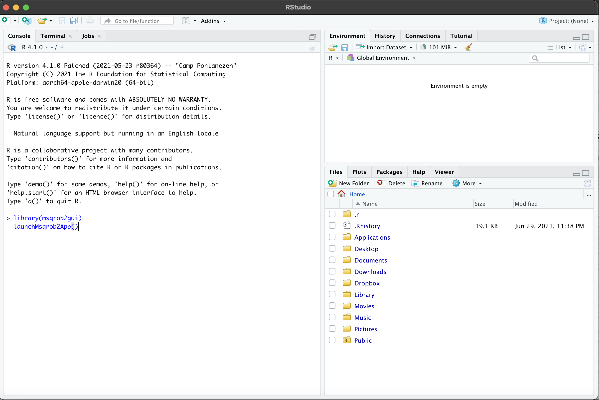
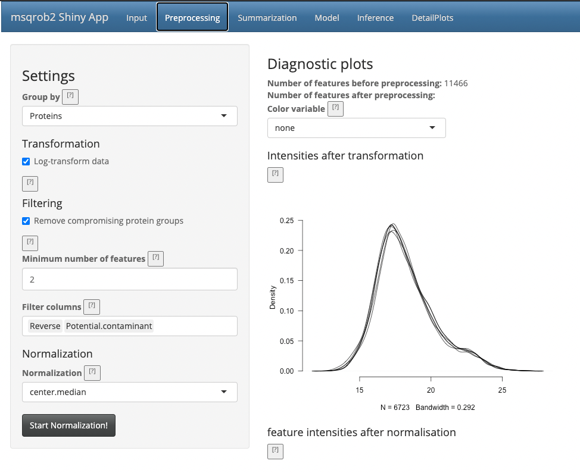
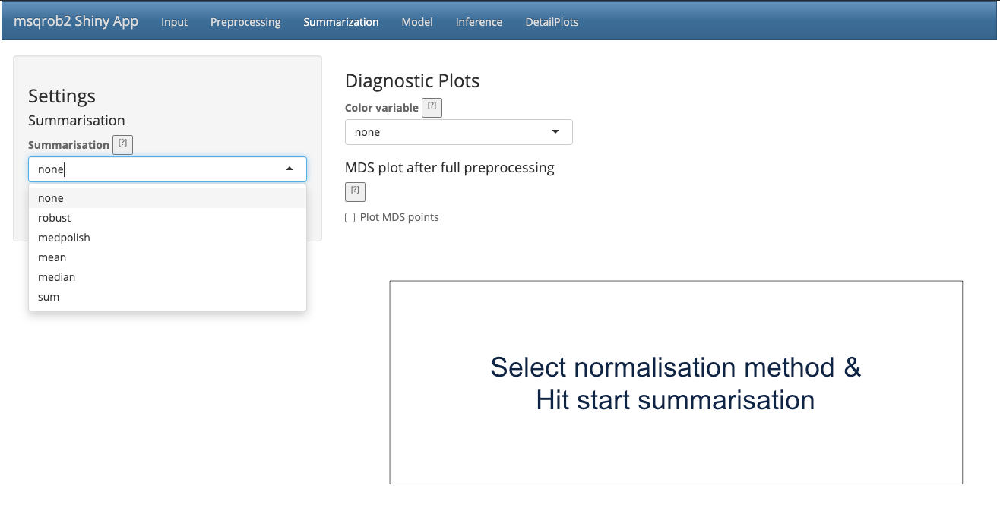
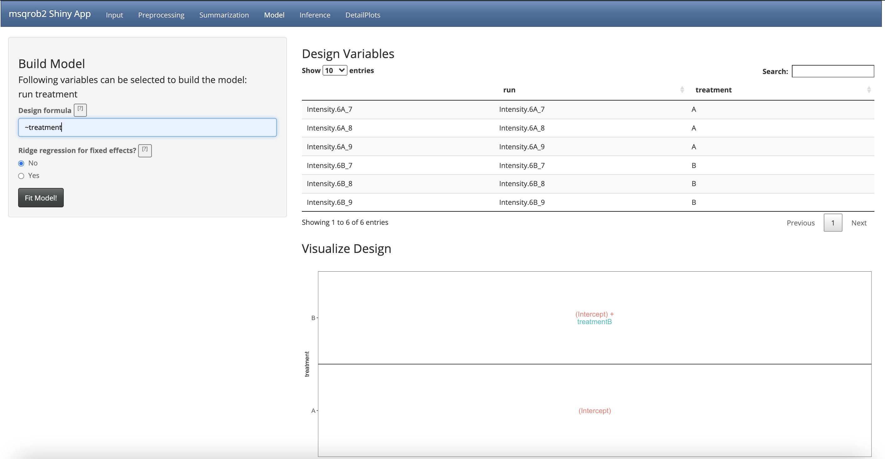

<a rel="license" href="https://creativecommons.org/licenses/by-nc-sa/4.0"></a>

<iframe width="560" height="315"
src="https://www.youtube.com/embed/F5d0E-U4rOM"
frameborder="0"
style="display: block; margin: auto;"
allow="autoplay; encrypted-media" allowfullscreen></iframe>      


### 2.2. Starting MSqRob

You can find the installation instructions for the installation of msqrob2 and the msqrob2gui graphical user interface (GUI)/shinyApp in [software](./software.html)

Upon installation 

1. Open Rstudio, you will see the following login window


2. Copy and paste following commands in the console window and type enter

```
library(msqrob2gui)
launchMsqrob2App()
```




- The first line will load the msqrob2gui package and its dependencies
- The second line will launch the GUI/shinyApp

3. A new window will open with the shinyApp


4. It is advicable to open the shiny app in a webbrowser. You can do that by clicking on the button `Open in Browser`, which you can find above the blue navigation bar and the shinyApp will pop up in a new browser tab/window. 


### 2.2.1. The Input tab

Our first step is to choose an appropriate name for the project. This name, appended with a timestamp, will be used when downloading results from the analysis. Here, we use the name “project_CPTAC_AvsB”.

Next, upload your peptides.txt file. This is the file that contains your peptide-level intensities. 
For a MaxQuant search [6], this peptides.txt file can be found by default in the “path_to_raw_files/combined/txt/” folder from the MaxQuant output, with “path_to_raw_files” the folder where raw files were saved. In this tutorial, we will use a MaxQuant peptides file from MaxQuant that can be found on the pdaData repository.

Similarly, upload the experimental annotation file which is called “experimental_annotation.xlsx”. This file should always be a tab-delimited file or an Office Open XML spreadsheet file (“.xlsx” file). Figure 2. shows how this file looks like for our experiment. One column (the “run” column in Fig. 3) of the experimental annotation file should always contain the names of the MS runs. For MaxQuant, these are the names given in the “Experiment” column when the data was searched. The names should be unique. Other columns indicate other variables related to the design that can affect protein expression; here this is only the treatment/spike-in condition.

You can generate an empty annotation file after uploading the peptide.txt file by clicking on the button generate annotation file. Then a download button will appear. The annotation file will contain one column named run with the names of the different runs in the peptide.txt file. 


Experimental annotation file have a typical structure. For the CPTAC dataset analyzed with MaxQuant, the first column equals the names given in MaxQuant’s “Experiment” column. Other columns indicate other variables related to the study design. Here it is only the treatment (“spike-in condition”).

*Hint: If the file location was already specified and the peptides file was uploaded, you can generate the “run” column of this file automatically in the output folder by clicking the “Create annotation file” button. The other columns need to be filled in manually based on the experimental design.*

After setting your output location and uploading your files, your input screen should look as follows:


At this stage, everything is set for preprocessing and data exploration, which are implemented in the preprocessing tab.

### 2.3.2. The Preprocessing tab

The preprocessing tab features different preprocessing options, many of which can be safely left at their default state. When you click the preprocessing tab, it should now look as follows:



The other normalization steps are performed upon hitting the “Start Normalization” button on the bottom of the Normalization tab. This is required to generate the normalized peptide object that is needed in the other panels of the app. Now, two additional plots are generated: the second plot shows the distributions of the peptides intensities In each runs after normalization and the third plot is an MDS plot. An MDS plot is a scatter plot that shows the runs in such a way that the distances on the plot are equal to the Euclidian distances of the top 500 most differing peptides between each pair of runs. If we log transform the data these distances are related to log fold changes.  Thus, runs that are plotted close to each other are more similar than samples that are far away from each other. Options are provided to show only dots, only labels or both. It is also possible to zoom in on a particular part of the plot by dragging the mouse to select a particular area on the plot and then double-click to zoom in.

 

The first preprocessing step is log-transformation.
Why is log-transformation needed? (Hint: untick the checkbox before “Log-transform data” and see what happens to the data distribution.) [2.3.2.a]

Why do we choose base 2? (Hint: think of the interpretation later on!) [2.3.2.b]
The next step is normalization. It is difficult to propose a one-size-fits-all normalization because the nature and extent of bias in the data are generally unknown. Thus, relative performance of different normalization methods might be different in different datasets [8].

What can you derive from the MDS plot after normalization? [2.3.2c]

Razor peptides are peptides that cannot be uniquely attributed to a single protein or protein group. As we are uncertain from which protein group these peptides originate and their intensities might even be a combined value from multiple protein groups, we opt to remove these peptides by default. The option “Remove comprising protein groups” deals with peptides that are shared between protein groups.  This option removes all peptides in protein groups for which any of its peptides map to a protein that is also present in another smaller protein group.

“Minimal number of peptides” indicates a threshold T for how many times a certain peptide sequence should be present in the data before being retained in the final analysis. Peptides that are identified at least T times are retained; other peptides are removed from the data. This value defaults to 2 and there is a very practical reason for this. Indeed, we need to correct for the peptide effect. However, when a peptide occurs only once, the peptide effect cannot be estimated. Note that this is not the same as applying the so-called “two-peptide rule” [9]. A protein identified by only one peptide can contribute to the estimation provided that the peptide is identified in multiple samples.

You can further filter out reverse sequences (left over from the MaxQuant search) and potential contaminants proteins (such as keratin from the operator's skin and hair, or leftover trypsin from digestion) [10], by providing the column names of the peptides file that indicate these sequences in the “Filter columns” field.

### 2.3.3. The Summarization tab
The preprocessing tab features different summarization options. When you click the preprocessing tab, the following screen is obtained:



When robust summarization is applied, the novel and much faster two-stage approach is used to fit the MSqRob model. Mean and median summarization are also implemented, but mainly for didactical reasons and to show the problems related to naive summarization methods. You always have to invoke the “Start Summarization!” button in order to create an object needed for downstream quantification. Depending on the method, summarization might take a while.

1. We first select the naive median summarization method and hit the “Start Summarization!” button. When the summarization is finished an MDS plot is generated based on the summarized intensities. 

2. We then select the robust method, which we will use in the downstream data analysis method so as to implement the two-stage MSqRob procedure.

What do you see upon summarization with the robust method and why would that be the case? [2.3.3.a]


### 2.3.4. The Model tab

When you click the Model tab, the following screen is obtained:


The Model tab shows information on the experimental design (annotation) in the right panel. 
In the left panel we have to propose the model to model the intensities of the preprocessed and summarized data. 

msqrob2 makes use of linear models for assessing differential expression. 
The models for are specified symbolically. 
The formula is build using the names of the design variables. 
A typical model has the form ‘ ~ terms’ where ‘terms’ is a series of terms which specifies a linear model. 

- A terms specification of the form ‘variable1’ will model the preprocessed intensities in function of the design variable ‘variable1’. If ‘variable1’ is a continuous variable this will result in a linear model with an intercept and a slope for the variable treatment. 
If ‘variable1’ is a factor variable it will result in a linear model with an intercept for the reference class and slope parameters with the interpretation of the average difference between the preprocessed intensity of the current class and the reference class. 

- A terms specification of the form ‘variable1 + variable2’ indicates the inclusion of the main effects (terms for all slope terms) for ‘variable1’ and ‘variable2’. 

- A specification of the form ‘variable1:variable2’ indicates the set of terms obtained by taking the interactions of all terms in ‘variable1’ with all terms in ‘variable2’, i.e. the effect of ‘variable1’ can be altered according to the value of ‘variable2’. 

- The specification ‘variable1\*variable’ indicates the *cross* of ‘variable1’ and ‘variable2’. This is the same as ‘variable1 + variable2 + variable1:variable2’.

Here, we only have one factor 'treatment' in the experimental design with two levels: spikein treatment A and B. 

1. So we will define the formula as 

`~ treatment`

Note that as soon as we do that, the design is visualised. 



This visualisation shows the different group means that are modelled. 

- Here we see that the group mean for the treatment A is modelled using the parameter 
```(Intercept)``` 

- The group mean for the treatment B is modelled using a linear combination of the two model parameters 
```(Intercept) + treatmentB```

Hence the average difference in preprocessed protein expression value between both conditions equals 
```treatmentB```

Remember that we log-transformed the intensities:

$$ 
\log_2FC_\text{B-}=\log_2 B - \log_2 A = \log_2\frac{B}{A} = \text{treatmentB}
$$

Note that a linear combination of model parameters is als referred to as a contrast in statistics. 
This contrast has the interpretation of a log2 fold change between condition 6B and condition 6A. Positive estimates denote that the abundance of the protein is on average higher in condition B, negative estimates denote that the abundance is on average higher in condition A. An estimate equal to 0 indicates that the estimated abundances are equal. 

A log2 FC = 1 indicates that the average abundance in condition B is 2 x higher than the average abundance in condition A, i.e. an 2 fold upregulation in condition B as compared to condition A.

2. We now have to click the `Fit Model!` button to fit the models for each protein.

We are now ready for assessing differential abundance of each protein using formal hypothesis testing. 

### 2.3.4. The Inference tab

When you click the Model tab, the following screen is obtained:


In the statistical analysis we will want to test the null hypothesis that

$$ H_0: \log_2 B-\log_2 6A = 0 $$

Against the alternative that
$$ H_1: \log_2 B - \log_2 A \neq 0 $$

1. We can specify the nulhypothesis as a linear combination of the model parameters, i.e. 

```treatmentB = 0```

This is what we have to fill in the field null hypothesis. 

We will falsify this null hypothesis for each protein separately based on the linear model. So, under the null hypothesis we reason that there is no effect of the spike-in treatment on the abundance of a specific protein. The p-value of the statistical test than indicates the probability to observe an effect (fold change), that is as extreme or more extreme (equally or more up or down regulated) than what is observed in the sample, by random change (when the null hypothesis is true and when there is in reality no effect of the treatment).


2. As soon as you specified the Null Hypothesis the window is updated 


and a volcano plot appears that gives you a view on statistical significance in the y-axis, i.e. the $-\log_{10}$ transformed p-value: a value of 1 equals to a p-value of 0.1, a value of 2 equals a p-value of 0.01, etc against biological relevance/the effect size in the x-axis, which is the $\log_2FC$. 

You also get a table with selected feature. By default this are all proteins that are significant with the specified significance level in the `Significance field`. 
You also obtain a boxplot of the log2-fold changes for all proteins that are selected in the table. 

Note that 20 proteins are displayed. The majority of them are UPS proteins that were spiked-in. Only one yeast protein is recovered in the top 20.

3. If you untick the option `only significant features in table` all proteins are shown in the table. 

4. You can also select proteins by selecting an area on the volcano plot. 
  
  - Click on the left mouse button and keep the button pressed and drag the mouse: a blue area appears

  - Double click to zoom in now the proteins are selected in the results table.   - Double click on an unselected area to reset the plot window.

5.  Selecting a protein(s) in the “Results table” results in selecting it on the Volcano plot.

6. You can search for specific proteins in the list by using the search field above the table. E.g. type `ups`.

7. If you select one protein in the table or by clicking on a point in the volcano-plot you can also explore the underlying normalised peptide intensities and protein intensities of the underlying data in the tab DetailPlots. 

### 2.3.4 The DetailPlots Tab

1. Select one protein in the table or by clicking on a point in the volcano-plot 

2. Clicking on the DetailPlot tab is visualising the data for your selected protein. 


3. You can further modify the plot by coloring the data according to a design variable or by splitting the data horizontally or vertically according to design variables. 

### 2.3.5. The Report Tab

A reproducible Rmarkdown script and html report with the analysis you performed with the GUI can be downloaded in the novel report tab. 


1. You can select the number of detail plots you want to generate in the report. The default is 10, which indicates that detail plots will be constructed for the 10 most significant protein in your top list. 
Note, that the number of detail plots can be smaller if there are less than 10 proteins significant at the specified FDR-level.

2. Hit the `Generate report` button and a report will be compiled. Note, that this will take a while because all analysis steps from each of the tabs have to be conducted again. You will see a progress bar and when it is finished a zip file will be downloaded that contains: 

  - features.txt: A tab delimited file with the raw intensity data
  - annotation.xlsx: An excel file with the annotation of the design
  - report.Rmd: R/markdown file with the code for the report. If you open the file in Rstudio and if you hit the knit button the report will be compiled to html. 
  - report.html: The compiled report. 

So, your analysis is stored in a fully reproducible way. 

### 2.3.6. Evaluate Summarization

We further explore the difference between summarization methods.
We first assess the quality of the fold change estimates for the robust summarization.
We will make use of the boxplot at the bottom of the quantification tab.

1. If you untick the option `only significant features in table` all proteins are shown in the table. The boxplot below the table visualizes the log2 fold change (FC) estimates for all proteins in the table.

2. We can now filter the ups proteins by typing "ups" in the search field above the table. Now all yeast proteins are removed from the results table and a boxplot of the ups protein log2 FCs will be made.


[2.3.6.a] We know the real FC for the spike in proteins (see description of the data 2.2). Note, that the boxplot is showing the log2 FC. What do you observe?

[2.3.6.b] Now select all yeast proteins. What is the real fold change and what do you observe?  

[2.3.6.c] Repeat this for the median summarization method. What do you observe, how does that compare to the robust summarisation and try to explain this?

### Final remark

- Note, that the shiny app is an interface to the statistical programming software R. 

- The analysis can also be conducted using scripts, which gives you much more functionality and the ability to streamline, automate and document your analyses in a reproducible way. 


