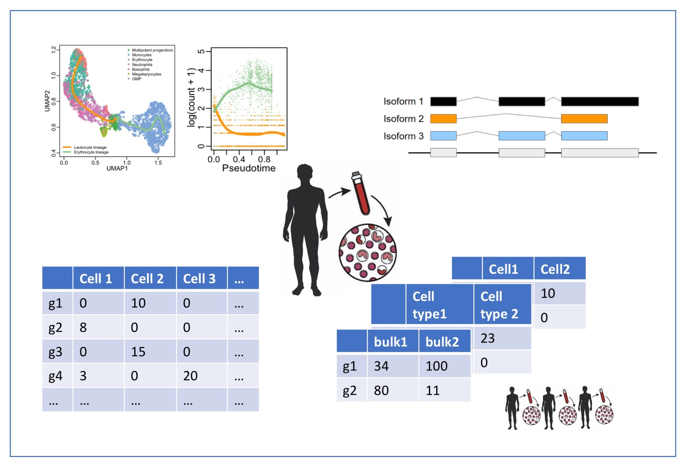

```{r echo=FALSE, warning=FALSE, message=FALSE}

```

# Course Description

High-throughput 'omics studies generate ever larger datasets and, as a consequence, complex data interpretation challenges. This course focusses on statistical concepts involved in preprocessing, quantification and differential analysis of high-throughput 'omics data. The core focus will be on shotgun proteomics and (bulk and single-cell) RNA-sequencing. Experimental design is essential to allow for correct interpretation in all 'omics studies, and we will cover how to design a statistically efficient experiment, as well as discuss the impact experimental design has on how we model 'omics data, introducing concepts such as blocking. The course will rely exclusively on free and user-friendly open-source tools in R/Bioconductor. We hope that this will provide a solid basis for beginners, but will also bring new perspectives to those already familiar with standard data analysis workflows for proteomics and next-generation sequencing applications.

# Target Audience

This course is oriented towards biologists and bioinformaticians with a particular interest in differential analysis for quantitative 'omics data.

# GitHub repository

All source and data files for this course are available on the accompanying [GitHub repository](https://github.com/statOmics/SGA21).

# Prerequisites

The prerequisites for the Statistical Genomics Analysis course are the successful completion of a basic course of statistics that covers topics on data exploration and descriptive statistics, statistical modeling, and inference: linear models, confidence intervals, t-tests, F-tests, anova, chi-squared test.
The basis concepts may be revisited in the online course at https://gtpb.github.io/PSLS20/ (English) and in https://statomics.github.io/statistiekCursusNotas/ (Dutch).

In addition, knowledge of programming in `R` is preferred. A primer to `R` and Data visualization in `R` can be found at:

 - `R` Basics: https://dodona.ugent.be/nl/courses/335/
 - `R` Data Exploration: https://dodona.ugent.be/nl/courses/345/


# Software 

- Participants are required to bring their own laptop with [R](https://www.r-project.org/) version 4.1.1 or greater. 

- We also recommend to also install the latest version of [RStudio](https://www.rstudio.com/products/rstudio/download/).

- Installation script: to install all required packages, please copy and paste this line of code in your R console.

```
source("https://raw.githubusercontent.com/statOmics/SGA21/master/install.R")
```

- Participants who have issues with the installation of the R/Rstudio can use an Rstudio instance in the cloud with all packages installed for the course in the mean time. Note, that this is instance is not for routine use. 

[](https://mybinder.org/v2/gh/statOmics/SGA21/binder?urlpath=rstudio)

# Detailed Program


1. Position of the course: [PDF](./docs/intro.pdf) 

2. Recap Linear Models (Week 1)

   - Lecture: [HTML](./recapGeneralLinearModel.html), [PDF](./recapGeneralLinearModel.pdf)
   - Tutorial KPNA2: [HTML](./multipleRegression_KPNA2.html),  [PDF](./multipleRegression_KPNA2.pdf)


## Module I: Proteomics Data Analysis (Week 1-5)


1. Bioinformatics for proteomics
   
   - Lecture: [PDF](./docs/martens_proteomics_bioinformatics.pdf), [youtube](https://www.youtube.com/watch?v=ZgwNWRul98o)
   - Tutorials: [identification](https://www.compomics.com/bioinformatics-for-proteomics/)

\newline

2. Preprocessing & Analysis of Simple Designs (week 3)
   
   - Lecture: [Preprocessing](./pda_quantification_preprocessing.html) [[PDF](./pda_quantification_preprocessing.pdf)]
   - Tutorial: [Preprocessing](./pda_tutorialPreprocessing.html)
   - Wrap-up: [Peptide-based Models](./pda_robustSummarisation_peptideModels.html) [[PDF](./pda_robustSummarisation_peptideModels.pdf)]

\newline

3. Statistical Inference & Analysis of Factorial Designs (Week 3-4)
   
   - Lecture: [Differential Abundance Analysis](./pda_quantification_inference.html) [[PDF](./pda_quantification_inference.pdf)]
   - Tutorial: [Design](pda_tutorialDesign.html)
   - Wrap-up: [Blocking](./pda_blocking_wrapup.html) [[PDF](./pda_blocking_wrapup.pdf)]
   
4. Advanced materials and reading materials

   - [Technical details: Inference upon summarization](./technicalDetailsProteomics.html)
   - [Stage-wise testing](./docs/stagewiseTesting.pdf)
   
   - Papers: 

      - [Sticker et al. (2020) Robust summarization and inference in proteome-wide label-free quantification](https://www.biorxiv.org/content/10.1101/668863v1)
      - [Ludger Goeminne: Extensive Background on proteomics and proteomics data analysis (Introduction of PhD)](./docs/backgroundProteomicsDataAnalysis.pdf)
      - [Van den Berge et al. (2017) Stage-wise testing: stageR paper](https://genomebiology.biomedcentral.com/articles/10.1186/s13059-017-1277-0)

5. Solutions

   - CPTAC study: See [wrap-up preprocessing](./pda_robustSummarisation_peptideModels.html)
   - [cancer 6x6](cancer2_6x6.html)
   - mouse: See [wrap-up blocking](./pda_blocking_wrapup.html)
   - [Heart study](heartMainInteractionStageR.html)
   
## Module II: Bulk RNA-sequencing


1. Introduction to sequencing technology, raw data and preprocessing.
   
   - Lecture: [Introduction to sequencing](./sequencing_intro.html) [[PDF](./sequencing_intro.pdf)].
   - Tutorial: [Preprocessing RNA-seq data](./sequencing_preprocessing.sh)
   - Recommended reading: [RNA Sequencing Data: Hitchhiker's Guide to Expression Analysis](https://www.annualreviews.org/doi/abs/10.1146/annurev-biodatasci-072018-021255)

\newline

2. Working with count data and generalized linear models.
   
   - Lecture: [Working with count data and GLMs](./sequencing_countData.html) [[PDF](./sequencing_countData.pdf)].
   - Tutorial I: Embedded within the lecture: Analysis of bike-sharing data.
   - Tutorial II: [GLM for one gene](sequencing_lab_oneGene.html).

\newline

3. Analysis of RNA-seq data.

   - Lecture + Tutorial: [Four major challenges in the analysis of RNA-seq datasets](./sequencing_rnaseqIntro.html) [[PDF](./sequencing_rnaseqIntro.pdf)].
   - [Why we use offsets rather than count scaling](sequencing_scalingNormalization.html).

\newline
   
4. Technical topics in bulk RNA-seq differential expression analysis (DEA).

   - Lecture: [Technical topics in DEA](./sequencing_technicalDE.html) [[PDF](./sequencing_technicalDE.pdf)].
   
## Module III: Single-cell RNA-sequencing

1. General concepts and analysis workflow of single-cell RNA-seq data.

   - Lecture: [Slides](https://docs.google.com/presentation/d/1sfbtw52qWgA7TcDIrGB3fWksLM0Mu9O7gBqYgGrt9fM/edit?usp=sharing).
      - [Variance stabilizing transformation for a Poisson random variable](./singleCell_varStabilization.html) [[PDF](./singleCell_varStabilization.pdf)].
      - [Understanding UMAP](https://pair-code.github.io/understanding-umap/)
   - [A reproducible workflow on the Macosko Drop-seq dataset](./scripts_singleCell/singleCell_MacoskoWorkflow.html)


# Instructors

 - [Koen Van den Berge](https://koenvandenberge.github.io/)
 - [Lieven Clement](./instructors.html)
 - [Lennart Martens](https://www.compomics.com/people/lennart-martens/)


# License

<a rel="license" href="https://creativecommons.org/licenses/by-nc-sa/4.0"></a>

This project is licensed under the [Creative Commons Attribution-NonCommercial-ShareAlike 4.0 International (CC BY-NC-SA 4.0)](https://creativecommons.org/licenses/by-nc-sa/4.0)

