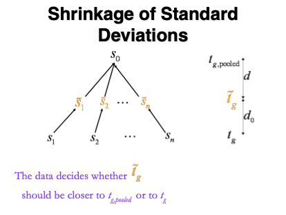

<a rel="license" href="https://creativecommons.org/licenses/by-nc-sa/4.0"></a>

This is part of the online course [Proteomics Data Analysis 2021 (PDA21)](https://statomics.github.io/PDA21/)

<iframe width="560" height="315"
src="https://www.youtube.com/embed/1mhg3BCuEm8"
frameborder="0"
style="display: block; margin: auto;"
allow="autoplay; encrypted-media" allowfullscreen></iframe>

- [Playlist PDA Preprocessing](https://www.youtube.com/watch?v=1mhg3BCuEm8&list=PLZH1hP8_LbJKqnPSS4hxTkn-tQolSCGjP)

# Outline {-}

- Francisella tularensis Example
- Hypothesis testing
- Multiple testing
- Moderated statistics
- Experimental design


Note, that the R-code is included for learners who are aiming to develop R/markdown scripts to automate their quantitative proteomics data analyses.
According to the target audience of the course we either work with a graphical user interface (GUI) in a R/shiny App msqrob2gui (e.g. Proteomics Bioinformatics course of the EBI and the Proteomics Data Analysis course at the Gulbenkian institute) or with R/markdowns scripts (e.g. Bioinformatics Summer School at UCLouvain or the Statistical Genomics Course at Ghent University). 

---

# Francisella tularensis experiment

<iframe width="560" height="315"
src="https://www.youtube.com/embed/TW5rk1y7aOc"
frameborder="0"
style="display: block; margin: auto;"
allow="autoplay; encrypted-media" allowfullscreen></iframe>

```{r echo=FALSE,out.width="50%"}
knitr::include_graphics("./figures/francisella.jpg")
```

```{r echo=FALSE}
knitr::include_graphics("./figures/tularemia_lesion.jpg")
```

- Pathogen: causes tularemia
- Metabolic adaptation key for intracellular life cycle of pathogenic microorganisms. 
- Upon entry into host cells quick phasomal escape and active multiplication in cytosolic compartment.
- Franciscella is auxotroph for several amino acids, including arginine. 
- Inactivation of arginine transporter delayed bacterial phagosomal escape and intracellular multiplication. 
- Experiment to assess difference in proteome using 3 WT vs 3 ArgP KO mutants


## Import the data in R 

<iframe width="560" height="315"
src="https://www.youtube.com/embed/2Ljd95IE_AY"
frameborder="0"
style="display: block; margin: auto;"
allow="autoplay; encrypted-media" allowfullscreen></iframe>


<details><summary> Click to see code </summary><p>
1. Load libraries 

```{r, warning=FALSE, message=FALSE}
library(tidyverse)
library(limma)
library(QFeatures)
library(msqrob2)
library(plotly)
library(ggplot2)
```

2. We use a peptides.txt file from MS-data quantified with maxquant that 
contains MS1 intensities summarized at the peptide level. 
```{r}
peptidesFile <- "https://raw.githubusercontent.com/statOmics/PDA21/data/quantification/francisella/peptides.txt"
```

3. Maxquant stores the intensity data for the different samples in columnns that start with Intensity. We can retreive the column names with the intensity data with the code below: 

```{r}
ecols <- grep("Intensity\\.", names(read.delim(peptidesFile)))
```

4. Read the data and store it in  QFeatures object 

```{r}
pe <- readQFeatures(
  table = peptidesFile,
  fnames = 1,
  ecol = ecols,
  name = "peptideRaw", sep="\t")
```

5. Update data with information on design

```{r}
colData(pe)$genotype <- pe[[1]] %>% 
  colnames %>% 
  substr(12,13) %>%
  as.factor %>% 
  relevel("WT")
pe %>% colData
```

</p></details>

## Preprocessing

<details><summary> Click to see code to log-transfrom the data </summary><p>

1. Log transform

  - Calculate number of non zero intensities for each peptide
```{r}
rowData(pe[["peptideRaw"]])$nNonZero <- rowSums(assay(pe[["peptideRaw"]]) > 0)
```

  - Peptides with zero intensities are missing peptides and should be represent
with a `NA` value rather than `0`.

```{r}
pe <- zeroIsNA(pe, "peptideRaw") # convert 0 to NA
```

  - Logtransform data with base 2

```{r}
pe <- logTransform(pe, base = 2, i = "peptideRaw", name = "peptideLog")
```

2. Filtering

  - Handling overlapping protein groups

```{r}
pe <- filterFeatures(pe, ~ Proteins %in% smallestUniqueGroups(rowData(pe[["peptideLog"]])$Proteins))
```

  - Remove reverse sequences (decoys) and contaminants. Note that this is indicated by the column names Reverse and depending on the version of maxQuant with Potential.contaminants or Contaminants.


```{r}
pe <- filterFeatures(pe,~Reverse != "+")
pe <- filterFeatures(pe,~ Contaminant != "+")
```

  - Drop peptides that were only identified in one sample

```{r}
pe <- filterFeatures(pe,~ nNonZero >=2)
nrow(pe[["peptideLog"]])
```

We keep `r nrow(pe[["peptideLog"]])` peptides upon filtering.

3. Normalization by median centering

```{r}
pe <- normalize(pe, 
                i = "peptideLog", 
                name = "peptideNorm", 
                method = "center.median")
```


4. Summarization. We use the standard sumarisation in aggregateFeatures, which is a
robust summarisation method.

```{r,warning=FALSE}
pe <- aggregateFeatures(pe,
    i = "peptideNorm", 
    fcol = "Proteins", 
    na.rm = TRUE,
    name = "protein")
```


Plot of preprocessed data 

```{r}
pe[["peptideNorm"]] %>% 
  assay %>%
  as.data.frame() %>%
  gather(sample, intensity) %>% 
  mutate(genotype = colData(pe)[sample,"genotype"]) %>%
  ggplot(aes(x = intensity,group = sample,color = genotype)) + 
    geom_density() +
    ggtitle("Peptide-level")

pe[["protein"]] %>% 
  assay %>%
  as.data.frame() %>%
  gather(sample, intensity) %>% 
  mutate(genotype = colData(pe)[sample,"genotype"]) %>%
  ggplot(aes(x = intensity,group = sample,color = genotype)) + 
    geom_density() +
    ggtitle("Protein-level")
```
</p></details>

## Summarized data structure

### Design

```{r}
pe %>% 
  colData %>% 
  knitr::kable()
```

- WT vs KO 
- 3 vs 3 repeats 

### Summarized intensity matrix

```{r}
pe[["protein"]] %>% assay() %>% head() %>% knitr::kable()
```

- `r nrow(pe[["protein"]])` proteins 

### Hypothesis testing: a single protein 

<iframe width="560" height="315"
src="https://www.youtube.com/embed/myP6SUlSwsM"
frameborder="0"
style="display: block; margin: auto;"
allow="autoplay; encrypted-media" allowfullscreen></iframe>

```{r echo=FALSE}
if ("pi"%in%ls()) rm("pi")
kopvoeter<-function(x,y,angle=0,l=.2,cex.dot=.5,pch=19,col="black")
{
angle=angle/180*pi
points(x,y,cex=cex.dot,pch=pch,col=col)
lines(c(x,x+l*cos(-pi/2+angle)),c(y,y+l*sin(-pi/2+angle)),col=col)
lines(c(x+l/2*cos(-pi/2+angle),x+l/2*cos(-pi/2+angle)+l/4*cos(angle)),c(y+l/2*sin(-pi/2+angle),y+l/2*sin(-pi/2+angle)+l/4*sin(angle)),col=col)
lines(c(x+l/2*cos(-pi/2+angle),x+l/2*cos(-pi/2+angle)+l/4*cos(pi+angle)),c(y+l/2*sin(-pi/2+angle),y+l/2*sin(-pi/2+angle)+l/4*sin(pi+angle)),col=col)
lines(c(x+l*cos(-pi/2+angle),x+l*cos(-pi/2+angle)+l/2*cos(-pi/2+pi/4+angle)),c(y+l*sin(-pi/2+angle),y+l*sin(-pi/2+angle)+l/2*sin(-pi/2+pi/4+angle)),col=col)
lines(c(x+l*cos(-pi/2+angle),x+l*cos(-pi/2+angle)+l/2*cos(-pi/2-pi/4+angle)),c(y+l*sin(-pi/2+angle),y+l*sin(-pi/2+angle)+l/2*sin(-pi/2-pi/4+angle)),col=col)
}

par(mar=c(0,0,0,0),mai=c(0,0,0,0))
plot(0,0,xlab="",ylab="",xlim=c(0,10),ylim=c(0,10),col=0,xaxt="none",yaxt="none",axes=FALSE)
rect(0,6,10,10,border="red",lwd=2)
text(.5,8,"population",srt=90,col="red",cex=2)
symbols (3, 8, circles=1.2, col="red",add=TRUE,fg="red",inches=FALSE,lwd=2)
set.seed(330)
grid=seq(0,1,.01)

for (i in 1:50)
{
	angle1=runif(n=1,min=0,max=360)
	angle2=runif(n=1,min=0,max=360)
	radius=sample(grid,prob=grid^2*pi/sum(grid^2*pi),size=1)
	kopvoeter(3+radius*cos(angle1/180*pi),8+radius*sin(angle1/180*pi),angle=angle2)
}
text(7.5,8,"Effect of arginine def. in population",col="red",cex=1.2)

rect(0,0,10,4,border="blue",lwd=2)
text(.5,2,"sample",srt=90,col="blue",cex=2)
symbols (3, 2, circles=1.2, col="red",add=TRUE,fg="blue",inches=FALSE,lwd=2)
for (i in 0:1)
	for (j in 0:2)
{

	kopvoeter(2.5+j*(3.9-2.1)/4,1.5+i)
}
text(7.5,2,"Effect of arginine def. in sample",col="blue",cex=1.2)

arrows(3,5.9,3,4.1,col="black",lwd=3)
arrows(7,4.1,7,5.9,col="black",lwd=3)
text(1.5,5,"Exp. Design",col="black",cex=1.2)
text(8.5,5,"Estimation \n Inference ",col="black",cex=1.2)
text(7.5,.5,"Data exploration",col="black",cex=1.2)
```

#### T-test

<iframe width="560" height="315"
src="https://www.youtube.com/embed/cVw5kdSRZCE"
frameborder="0"
style="display: block; margin: auto;"
allow="autoplay; encrypted-media" allowfullscreen></iframe>


$$
 \log_2 \text{FC} = \bar{y}_{p1}-\bar{y}_{p2}
$$

$$
T_g=\frac{\log_2 \text{FC}}{\text{se}_{\log_2 \text{FC}}}
$$

$$
T_g=\frac{\widehat{\text{signal}}}{\widehat{\text{Noise}}}
$$

If we can assume equal variance in both treatment groups:

$$
\text{se}_{\log_2 \text{FC}}=\text{SD}\sqrt{\frac{1}{n_1}+\frac{1}{n_2}}
$$

```{r}
WP_003023392 <- data.frame(
    intensity = assay(pe[["protein"]]["WP_003023392",]) %>% c(), 
    genotype = colData(pe)[,1]) 

WP_003023392 %>% 
  ggplot(aes(x=genotype,y=intensity)) + 
  geom_point() +
  ggtitle("Protein WP_003023392")
```

```{r echo=FALSE}
lmHlp <- lm(intensity ~ genotype, data = WP_003023392)
```

$$
t=\frac{\log_2\widehat{\text{FC}}}{\text{se}_{\log_2\widehat{\text{FC}}}}=\frac{`r format(summary(lmHlp)$coef[2,1], digit = 3)`}{`r format(summary(lmHlp)$coef[2,2], digit = 3)`}=`r format(summary(lmHlp)$coef[2,3], digit = 3)`
$$

- Is t = `r format(summary(lmHlp)$coef[2,3], digit = 3)` indicating that
there is an effect?

- How likely is it to observe
t = `r format(summary(lmHlp)$coef[2,3], digit = 3)` when there is no effect of the argP KO on the protein expression?

#### Null hypothesis ($H_0$) and alternative hypothesis ($H_1$)

- With data we can never prove a hypothesis (falsification principle of Popper)
- With data we can only reject a hypothesis 

- In general we start from *alternative hypothese* $H_1$: we want to show an effect of the KO on a protein

<center>
$H_1$: On average the protein abundance in WT is different from that in KO
</center>

- But, we will assess this by falsifying the opposite: 
<center>
$H_0$: On average the protein abundance in WT is equal to that in KO<-
</center>


```{r}
t.test(intensity ~ genotype, data = WP_003023392, var.equal=TRUE)
```

- How likely is it to observe an equal or more extreme effect than the one observed in the sample when the null hypothesis is true?
- When we make assumptions about the distribution of our test statistic we can quantify this probability: *p-value*. 
The p-value will only be calculated correctly if the underlying assumptions hold!
- When we repeat the experiment, the probability to observe a fold change for this gene that is more extreme than a `r format(2^abs(lmHlp$coef[2]),digits=3)` fold ($\log_2 FC=`r format(lmHlp$coef[2],digits=3)`$) down or up regulation by random change (if $H_0$ is true) is `r round(summary(lmHlp)$coef[2,4]*1e6,0)` out of 1 000 000.  
- If the p-value is below a significance threshold $\alpha$ we reject the null hypothesis. *We control the probability on a false positive result at the $\alpha$-level (type I error)*

- Note, that the p-values are uniform under the null hypothesis, i.e. when $H_0$ is true all p-values are equally likely. 

## Multiple hypothesis testing

<iframe width="560" height="315"
src="https://www.youtube.com/embed/cLn-CFyA6ps"
frameborder="0"
style="display: block; margin: auto;"
allow="autoplay; encrypted-media" allowfullscreen></iframe>

- Consider testing DA for all $m=1066$ proteins simultaneously
- What if we assess each individual test at level $\alpha$?
$\rightarrow$ Probability to have a false positive (FP) among all m simultatenous
test $>>>  \alpha= 0.05$

- Indeed for each non DA protein we have a probability of 5% to return a FP.
- In a typical experiment the majority of the proteins are non DA. 
- So an upperbound of the expected FP is $m \times \alpha$ or $1066 \times 0.05=`r round(1066*0.05,0)`$. 

$\rightarrow$ Hence, we are bound to call many false positive proteins each time we run the experiment.

### Multiple testing

#### Family-wise error rate

<iframe width="560" height="315"
src="https://www.youtube.com/embed/IL_eUSyRDRA"
frameborder="0"
style="display: block; margin: auto;"
allow="autoplay; encrypted-media" allowfullscreen></iframe>

The family-wise error rate (FWER) addresses the multiple testing issue by no longer controlling the individual type I error for each protein, instead it controls:  

\[
   \text{FWER} = 
   \text{P}\left[FP \geq 1 \right].
\]

The Bonferroni method is widely used to control the type I error: 

- assess each test at 
\[\alpha_\text{adj}=\frac{\alpha}{m}\]
- or use adjusted p-values and compare them to $\alpha$: 
\[p_\text{adj}=\text{min}\left(p \times m,1\right)\]

Problem, the method is very conservative! 

#### False discovery rate

<iframe width="560" height="315"
src="https://www.youtube.com/embed/envDqvEwRcc"
frameborder="0"
style="display: block; margin: auto;"
allow="autoplay; encrypted-media" allowfullscreen></iframe>

- FDR: Expected proportion of false positives on the total number of positives you return.
- An FDR of 1% means that on average we expect 1% false positive proteins in the list of proteins that are called significant.
- Defined by Benjamini and Hochberg in their seminal paper Benjamini, Y. and Hochberg, Y. (1995). "Controlling the false discovery rate: a practical and powerful approach to multiple testing". Journal of the Royal Statistical Society Series B, 57 (1): 289–300. 

The **False Discovery Proportion (FDP)** is the fraction of false positives that are returned, i.e. 

\[
FDP = \frac{FP}{R}
\]

- However, this quantity cannot be observed because in practice we only know the number of proteins for which we rejected $H_0$, $R$. 
- But, we do not know the number of false positives, $FP$.

Therefore, Benjamini and Hochberg, 1995, defined The **False Discovery Rate (FDR)** as
\[
   \text{FDR} = \text{E}\left[\frac{FP}{R}\right] =\text{E}\left[\text{FDP}\right]
\]
the expected FDP. 

- Controlling the FDR allows for more discoveries (i.e. longer lists with significant results), while the fraction of false discoveries among the significant results in well controlled on average. As a consequence, more of the true positive hypotheses will be detected.


#### Intuition of BH-FDR procedure

Consider $m = 1000$ tests

- Suppose that a researcher rejects all null hypotheses for which $p < 0.01$. 

- If we use $p < 0.01$, we expect $0.01 \times m_0$ tests to return false positives. 
- A conservative estimate of the number of false positives that we can expect can be obtained by considering that the null hypotheses are true for all features, $m_0 = m =  1000$. 
- We then would expect $0.01 \times 1000 = 10$ false positives ($FP=10$).

- Suppose that the researcher found 200 genes with $p<0.01$ ($R=200$).

- The proportion of false positive results (FDP = false positive proportion) among the list of $R=200$ genes can then be estimated as
 \[
   \widehat{\text{FDP}}=\frac{FP}{R}=\frac{10}{200}=\frac{0.01 \times 1000}{200} = 0.05.
 \]


#### Benjamini and Hochberg (1995) procedure for controlling the FDR at $\alpha$

1. Let $p_{(1)}\leq \ldots \leq p_{(m)}$ denote the ordered $p$-values.

2. Find the largest integer $k$ so that 
$$
\frac{p_{(k)} \times m}{k} \leq \alpha
$$
$$\text{or}$$
$$
p_{(k)} \leq k \times \alpha/m
$$

3. If such a $k$ exists, reject the $k$ null hypotheses associated with $p_{(1)}, \ldots, p_{(k)}$.
Otherwise none of the null hypotheses is rejected.

The adjusted $p$-value (also known as the $q$-value in FDR literature):
 $$
   q_{(i)}=\tilde{p}_{(i)} = \min\left[\min_{j=i,\ldots, m}\left(m p_{(j)}/j\right), 1 \right].
 $$
 In the hypothetical example above: $k=200$, $p_{(k)}=0.01$, $m=1000$ and $\alpha=0.05$.

#### Francisella Example

<iframe width="560" height="315"
src="https://www.youtube.com/embed/B3BmnOLkYg4"
frameborder="0"
style="display: block; margin: auto;"
allow="autoplay; encrypted-media" allowfullscreen></iframe>

<details><summary> Click to see code </summary><p>
```{r}
ttestMx <- function(y,group) {
    test <- try(t.test(y[group],y[!group],var.equal=TRUE),silent=TRUE)
    if(is(test,"try-error")) {
      return(c(log2FC=NA,se=NA,tstat=NA,p=NA))
      } else {
      return(c(log2FC= (test$estimate%*%c(1,-1)),se=test$stderr,tstat=test$statistic,pval=test$p.value))
      }
 }
 
 res <- apply(
    assay(pe[["protein"]]), 
    1, 
    ttestMx,
    group = colData(pe)$genotype=="D8") %>% 
  t 
 colnames(res) <- c("logFC","se","tstat","pval")
 res <- res %>% as.data.frame %>% na.exclude %>% arrange(pval)
 res$adjPval <- p.adjust(res$pval, "fdr")
 alpha <- 0.05
res$adjAlphaForm <- paste0(1:nrow(res)," x ",alpha,"/",nrow(res))
res$adjAlpha <- alpha * (1:nrow(res))/nrow(res) 
res$"pval < adjAlpha" <- res$pval < res$adjAlpha 
res$"adjPval < alpha" <- res$adjPval < alpha 
```
</p></details>

FWER: Bonferroni method:$\alpha_\text{adj} = \alpha/m = 0.05 / `r nrow(res)`= `r round(alpha/nrow(res),5)`$

```{r echo=FALSE} 
head(res[,-c(2:3)],sum(res$adjPval < alpha)+2) %>% knitr::kable()
```
| ... | ... | ... | ... | ... | ... | ... | ... |
|WP_003040562 | 0.0039480| 0.9976429| 0.9985797|1065 x 0.05/1066 | 0.0499531|FALSE           |FALSE    
|WP_003041130 | 0.0002941| 0.9992812| 0.9992812|1066 x 0.05/1066 |     0.05|FALSE           |FALSE           |


#### Results
<details><summary> Click to see code </summary><p>
```{r}
volcanoT <- res %>% 
  ggplot(aes(x = logFC, y = -log10(pval), color = adjPval < 0.05)) +
    geom_point(cex = 2.5) +
    scale_color_manual(values = alpha(c("black", "red"), 0.5)) +
    theme_minimal() 
```
</p></details>


```{r}
volcanoT
```

## Moderated Statistics

<iframe width="560" height="315"
src="https://www.youtube.com/embed/_Q11LXDy0xU"
frameborder="0"
style="display: block; margin: auto;"
allow="autoplay; encrypted-media" allowfullscreen></iframe>

Problems with ordinary t-test

<details><summary> Click to see code </summary><p>
```{r}
problemPlots <- list() 
problemPlots[[1]] <- res %>% 
  ggplot(aes(x = logFC, y = se, color = adjPval < 0.05)) +
    geom_point(cex = 2.5) +
    scale_color_manual(values = alpha(c("black", "red"), 0.5)) +
    theme_minimal() 

for (i in 2:3)
{
problemPlots[[i]] <- colData(pe) %>% 
    as.data.frame %>% 
    mutate(intensity = pe[["protein"]][rownames(res)[i],] %>% 
             assay %>% 
             c) %>% 
    ggplot(aes(x=genotype,y=intensity)) +
    geom_point() + 
    ylim(-3,0) +
    ggtitle(rownames(res)[i])
}
```
</p></details>

```{r}
problemPlots
```

A general class of moderated test statistics is given by
 \[
   T_g^{mod} = \frac{\bar{Y}_{g1} - \bar{Y}_{g2}}{C \quad \tilde{S}_g} ,
 \]
 where $\tilde{S}_g$ is a moderated standard deviation estimate. 

- $C$ is a constant depending on the design e.g. $\sqrt{1/{n_1}+1/n_2}$ for a t-test and of another form for linear models.
- $\tilde{S}_g=S_g+S_0$: add small positive constant to denominator of t-statistic. 
- This can be adopted in Perseus. 

<details><summary> Click to see code </summary><p>
```{r}
simI<-sapply(res$se/sqrt(1/3+1/3),function(n,mean,sd) rnorm(n,mean,sd),n=6,mean=0) %>% t
resSim <- apply(
    simI, 
    1, 
    ttestMx,
    group = colData(pe)$genotype=="D8") %>% 
  t 
 colnames(resSim) <- c("logFC","se","tstat","pval")
 resSim <- as.data.frame(resSim)
 tstatSimPlot <- resSim %>% 
   ggplot(aes(x=tstat)) +
     geom_histogram(aes(y=..density.., fill=..count..),bins=30) +
     stat_function(fun=dt,
    color="red",
    args=list(df=4)) + 
   ylim(0,.6) +
   ggtitle("t-statistic")

 
 resSim$C <- sqrt(1/3+1/3) 
 resSim$sd <- resSim$se/resSim$C 
 tstatSimPerseus <- resSim %>% 
   ggplot(aes(x=logFC/((sd+.1)*C))) +
     geom_histogram(aes(y=..density.., fill=..count..),bins=30) +
     stat_function(fun=dt,
                   color="red",
                  args=list(df=4)) + 
     ylim(0,.6) +
    ggtitle("Perseus")
```

</p></details>

```{r}
gridExtra::grid.arrange(tstatSimPlot,tstatSimPerseus,nrow=1)
```

- The choice of $S_0$ in Perseus is ad hoc and the t-statistic is no-longer t-distributed. 
- Permutation test, but is difficult for more complex designs.
- Allows for Data Dredging because user can choose $S_0$ 


### Empirical Bayes 


```{r echo=FALSE, out.width="50%"}

```

Figure courtesy to Rafael Irizarry

$$
   T_g^{mod} = \frac{\bar{Y}_{g1} - \bar{Y}_{g2}}{C \quad \tilde{S}_g} ,
 $$

- **empirical Bayes** theory provides formal framework for borrowing strength across proteins,
- Implemented in popular bioconductor package **limma** and **msqrob2**

$$
  \tilde{S}_g=\sqrt{\frac{d_gS_g^2+d_0S_0^2}{d_g+d_0}},
$$

- $S_0^2$: common variance (over all proteins) 
- Moderated t-statistic is t-distributed with $d_0+d_g$ degrees of freedom. 
- Note that the degrees of freedom increase by borrowing strength across proteins!

<details><summary> Click to see the code </summary><p>   

1. We model the protein level expression values using the `msqrob` function.
By default `msqrob2` estimates the model parameters using robust regression.

We will model the data with a different group mean for every genotype. 
The group is incoded in the variable `genotype` of the colData. 
We can specify this model by using a formula with the factor `genotype` as its predictor: 
`formula = ~genotype`.

Note, that a formula always starts with a symbol '~'.
```{r warning=FALSE}
pe <- msqrob(object = pe, i = "protein", formula = ~genotype)
```

2. Inference 

We first explore the design of the model that we specified using the the package `ExploreModelMatrix` 

```{r}
library(ExploreModelMatrix)
VisualizeDesign(colData(pe),~genotype)$plotlist[[1]]
```

We have two model parameters, the (Intercept) and genotypeD8. 
This results in a model with two group means: 

1. For the wild type (WT) the expected value (mean) of the log2 transformed intensity y for a protein will be modelled using 

$$\text{E}[Y\vert \text{genotype}=\text{WT}] = \text{(Intercept)}$$ 

2. For the knockout genotype D8 the expected value (mean) of the log2 transformed intensity y for a protein will be modelled using 

$$\text{E}[Y\vert \text{genotype}=\text{D8}] = \text{(Intercept)} + \text{genotypeD8}$$ 

The average log2FC between D8 and WT is thus
$$\log_2\text{FC}_{D8-WT}= \text{E}[Y\vert \text{genotype}=\text{D8}] - \text{E}[Y\vert \text{genotype}=\text{WT}] = \text{genotypeD8}
$$

Hence, assessing the null hypothesis that there is no differential abundance between D8 and WT can be reformulated as

$$H_0:  \text{genotypeD8}=0$$
We can implement a hypothesis test for each protein in msqrob2 using the code below: 

```{r}
L <- makeContrast("genotypeD8 = 0", parameterNames = c("genotypeD8"))
pe <- hypothesisTest(object = pe, i = "protein", contrast = L)
```

We can show the list with all significant DE proteins at the 5% FDR using 
```{r}
rowData(pe[["protein"]])$genotypeD8 %>% 
  arrange(pval) %>%
  filter(adjPval<0.05)
```

We can also visualise the results using a volcanoplot

```{r}
volcano <- ggplot(
    rowData(pe[["protein"]])$genotypeD8,
    aes(x = logFC, y = -log10(pval), color = adjPval < 0.05)
) +
    geom_point(cex = 2.5) +
    scale_color_manual(values = alpha(c("black", "red"), 0.5)) +
    theme_minimal() +
    ggtitle("msqrob2")
```
</p></details>

```{r}
gridExtra::grid.arrange(
  volcanoT +    
    xlim(-3,3) +
  ggtitle("ordinary t-test"),
  volcano +     
    xlim(-3,3)
,nrow=2)
```

- The volcano plot opens up when using the EB variance estimator

-  Borrowing strength to estimate the variance using empirical Bayes solves the issue of returning proteins with a low fold change as significant due to a low variance. 


### Shrinkage of the  variance and moderated t-statistics

```{r}
qplot(
  sapply(rowData(pe[["protein"]])$msqrobModels,getSigma),
  sapply(rowData(pe[["protein"]])$msqrobModels,getSigmaPosterior)) +
  xlab("SD") +
  ylab("moderated SD") +
  geom_abline(intercept = 0,slope = 1) +
  geom_hline(yintercept = ) 
```

- Small variances are shrunken towards the common variance resulting in large EB variance estimates
- Large variances are shrunken towards the common variance resulting in smaller EB variance estimates 
- Pooled degrees of freedom of the EB variance estimator are larger because information is borrowed across proteins to estimate the variance

## Plots 

```{r}
sigNames <- rowData(pe[["protein"]])$genotypeD8 %>%
    rownames_to_column("protein") %>%
    filter(adjPval < 0.05) %>%
    pull(protein)
heatmap(assay(pe[["protein"]])[sigNames, ])
```


```{r, warning=FALSE, message=FALSE}
for (protName in sigNames)
    {
        pePlot <- pe[protName, , c("peptideNorm", "protein")]
        pePlotDf <- data.frame(longFormat(pePlot))
        pePlotDf$assay <- factor(pePlotDf$assay,
            levels = c("peptideNorm", "protein")
        )
        pePlotDf$genotype <- as.factor(colData(pePlot)[pePlotDf$colname, "genotype"])

        # plotting
        p1 <- ggplot(
            data = pePlotDf,
            aes(x = colname, y = value, group = rowname)
        ) +
            geom_line() +
            geom_point() +
            facet_grid(~assay) +
            theme(axis.text.x = element_text(angle = 70, hjust = 1, vjust = 0.5)) +
            ggtitle(protName)
        print(p1)

        # plotting 2
        p2 <- ggplot(pePlotDf, aes(x = colname, y = value, fill = genotype)) +
            geom_boxplot(outlier.shape = NA) +
            geom_point(
                position = position_jitter(width = .1),
                aes(shape = rowname)
            ) +
            scale_shape_manual(values = 1:nrow(pePlotDf)) +
            labs(title = protName, x = "sample", y = "peptide intensity (log2)") +
            theme(axis.text.x = element_text(angle = 70, hjust = 1, vjust = 0.5)) +
            facet_grid(~assay)
        print(p2)
}
```

# Experimental Design

## Sample size 

<iframe width="560" height="315"
src="https://www.youtube.com/embed/uELgkzDjVRY"
frameborder="0"
style="display: block; margin: auto;"
allow="autoplay; encrypted-media" allowfullscreen></iframe>

$$
 \log_2 \text{FC} = \bar{y}_{p1}-\bar{y}_{p2}
$$

$$
T_g=\frac{\log_2 \text{FC}}{\text{se}_{\log_2 \text{FC}}}
$$

$$
T_g=\frac{\widehat{\text{signal}}}{\widehat{\text{Noise}}}
$$

If we can assume equal variance in both treatment groups:

$$
\text{se}_{\log_2 \text{FC}}=\text{SD}\sqrt{\frac{1}{n_1}+\frac{1}{n_2}}
$$

$\rightarrow$ if number of bio-repeats increases we have a higher power!

- cfr. Study of tamoxifen treated Estrogen Recepter (ER) positive breast cancer patients

## Blocking 

<iframe width="560" height="315"
src="https://www.youtube.com/embed/DsRuicONr-Q"
frameborder="0"
style="display: block; margin: auto;"
allow="autoplay; encrypted-media" allowfullscreen></iframe>

\[\sigma^2= \sigma^2_{bio}+\sigma^2_\text{lab} +\sigma^2_\text{extraction} + \sigma^2_\text{run} + \ldots\]

- Biological: fluctuations in protein level between mice, fluctations in protein level between cells, ...
- Technical: cage effect, lab effect, week effect, plasma extraction, MS-run, ...

## Nature methods: Points of significance - Blocking 

[https://www.nature.com/articles/nmeth.3005.pdf](https://www.nature.com/articles/nmeth.3005.pdf)


## Mouse example 

```{r echo=FALSE, out.width="50%"}
knitr::include_graphics("./figures/mouseTcell_RCB_design.png")
```
Duguet et al. (2017) MCP 16(8):1416-1432. doi: 10.1074/mcp.m116.062745

- All treatments of interest are present within block!
- We can estimate the effect of the treatment within block!
- We can isolate the between block variability from the analysis using linear model:
$$ 
y \sim \text{type} + \text{mouse}
$$
- Not possible with Perseus!

### Assess the impact of blocking in the tutorial session!

- Completely randomized design with only one cell type per mouse (Treg and Tconv)

$$\updownarrow$$

- Randomized complete block design assessing Treg and Tconv on each mouse

# Software & code

- Our R/Bioconductor package [msqrob2](https://www.bioconductor.org/packages/release/bioc/html/msqrob2.html) can be used in R markdown scripts or with a GUI/shinyApp in the [msqrob2gui](https://github.com/statOmics/msqrob2gui) package.

- The GUI is intended as a introduction to the key concepts of proteomics data analysis for users who have no experience in R. 

- However, learning how to code data analyses in R markdown scripts is key for open en reproducible science and for reporting your proteomics data analyses and interpretation in a reproducible way. 


- More information on our tools can be found in our papers [@goeminne2016], [@goeminne2020] and [@sticker2020]. Please refer to our work when using our tools. 

- Clips on the code on importing the data and preprocessing can be found in [Part I Preprocessing](./pda_quantification_preprocessing.html)

- A clip on the code for modelling and statistical inference with msqrob2 is included below

<iframe width="560" height="315"
src="https://www.youtube.com/embed/eXxIdzGOPgY"
frameborder="0"
style="display: block; margin: auto;"
allow="autoplay; encrypted-media" allowfullscreen></iframe>

# References