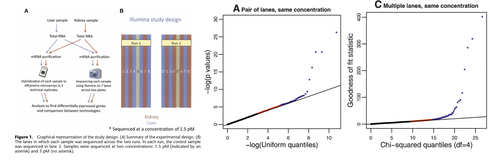

```{r setup, include=FALSE}
knitr::opts_chunk$set(echo = TRUE)
suppressPackageStartupMessages({
  library(knitr)
  library(rmarkdown)
  library(ggplot2)
})
```


# The Poisson distribution

 - The Poisson distribution is a typical count distribution that is generally popular and fairly easy to work with. It is defined by a single parameter: its mean $\mu$. For a Poisson distributed random variable $Y_i$ with observations $i \in \{1, \ldots, n\}$, its variance is equal to its mean. That is, if $Y_i \sim Poi(\mu)$, then $E(Y_i) = Var(Y_i) = \mu$.
 - This immediately shows an important feature of count data: the **mean-variance relationship**. Indeed, in count data, the variance will always be a function of the mean.
 - This is quite intuitive. Consider the following example. You have two bird cages, where in one bird cage there are $10$ birds, while in the other there are $100$ birds. You let a sample of people count the number of birds in either one of the cages. It seems unlikely that a person in front of the 10-bird cage would come up with an estimate of $5$, while it seems quite likely that someone in front of the 100-bird cage would come up with an estimate of $95$. Even though the difference from the true value is the same, the exact value has an impact on the plausible deviation around it.
 

**TODO**: Make into discrete barplot.
 
```{r}
set.seed(11)
y1 <- rpois(n=500, lambda=10)
y2 <- rpois(n=500, lambda=100)

par(mfrow = c(1,2))
hist(y1, main="Poisson(10)", breaks=40)
hist(y2, main="Poisson(100)", breaks=40)
```

## The Poisson distribution in RNA-seq

 - In RNA-seq, technical replicates represent different aliquots of the same sample being repeatedly. The underlying true expression of a gene can hence safely be assumed to be equal across these technical replicates.
 - [Marioni *et al.* (2008)](https://genome.cshlp.org/content/18/9/1509) have shown that, for most genes, the distribution of observed gene expression counts across technical replicates follow a Poisson distribution. A small proportion of genes ($\sim 0.5\%$) do not follow this Poisson model, however, and actually show evidence for *`extra-Poisson variation'*.
 
```{r, echo=FALSE, fig.cap=paste("Figure: Technical replication in RNA-seq. Figures from Marioni et al. (2008).")}
# All defaults

```

## Relative uncertainty for Poisson distributed random variables

Take a minute to consider the following question:

 - Suppose that we have a solid tumor sample from a cancer patient, as well as a sample of surrounding healthy tissue. For each sample, we have three technical replicates at our disposal. Let $Y_{grt}$ denote the observed gene expression values of gene $g$ in replicate $r$ from tissue $t \in \{0,1\}$, where $t=0$ denotes healthy tissue and $t=1$ denotes tumoral tissue. 
 - We then know that the random variables $Y_{gr0}$ and $Y_{gr1}$ follow a Poisson distribution, and we would estimate its mean as $\bar{Y}_{g0} = \frac{1}{3} \sum_{r=1}^3 Y_{gr0}$ and $\bar{Y}_{g1} = \frac{1}{3} \sum_{r=1}^3 Y_{gr1}$, respectively. 
 - Similar, for another gene $k$, we observe $Y_{krt}$, and estimate $\bar{Y}_{k0}$ and $\bar{Y}_{k1}$ correspondingly.
 - Now suppose that $\beta_{k} = \bar{Y}_{k1} / \bar{Y}_{k0} = 5$, but also $\beta_g = \bar{Y}_{g1} / \bar{Y}_{g0} = 5$, i.e., the two genes have the same average expression ratio (also often called a fold-change) across samples. However, they are differently expressed as $\bar{Y}_{k1} = 100$, and $\bar{Y}_{g1} = 10$ (making $\bar{Y}_{k0} = 20$, and $\bar{Y}_{g0} = 2$).
 - For which of the two genes is the uncertainty on the expression ratio the highest? In other words, do we trust $\beta_k$ more or do we trust $\beta_g$ more?
 
 ---

Let's approximate the uncertainty in $beta_g$ and $\beta_k$ using simulation:
 
```{r}
N <- 1e3
beta_g <- beta_k <- vector(length=N)
for(ii in 1:N){
  ygr1 <- rpois(n=3, lambda=10)
  ygr0 <- rpois(n=3, lambda=2)
  ykr1 <- rpois(n=3, lambda=100)
  ykr0 <- rpois(n=3, lambda=20)
  beta_g[ii] <- mean(ygr1) / mean(ygr0)
  beta_k[ii] <- mean(ykr1) / mean(ykr0)
}

par(mfrow=c(1,2), mar=c(4,2,3,1))
hist(beta_g, breaks=seq(0,50,by=1), xlim=c(0,50))
hist(beta_k, breaks=seq(0,50,by=1), xlim=c(0,50))
```
 
 --- 
 
 We clearly see that the uncertainty on $\beta_g$ is much lower than on $\beta_k$. Even though the variance on the counts of gene $g$ is higher, since its mean is higher and it is distributed as a Poisson variable. How do we explain this?
 
 - We may explain this by considering the relative uncertainty on the mean. Relative uncertainty can be defined as the coefficient of variation $CV = \frac{\sigma}{\mu}$ (this is, the standard deviation divided by the mean). Indeed, the CV describes the relative deviation of the distribution relative to its mean, where a low CV indicates low dispersion with respect to the mean.
 - Calculating the CV shows that **the relative uncertainty for gene $k$ than for gene $g$, even though the variance on the raw counts is higher for gene $k$ than for gene $g$**. 
 - This lower relative uncertainty on the mean then propagates further to a lower uncertainty on the fold-change. This basic result will be essential for understanding the results of a differential expression analysis!
 
```{r}
sqrt(100)/100 #CV for gene k

sqrt(10)/10 #CV for gene g
```
 
# Modeling count data: Generalized linear models

Just like we have modeled protein abundances in the proteomics part of this course to assess differential protein abundance, we can model gene expression counts to identify genes with differences in average expression between groups of samples.

## Why we can('t) use linear models to model count data

 - If we're using a linear model to model a response $Y_i$, with $i \in \{1, \ldots, n\}$ in function of a single covariate $X_i$, the linear model can be defined as follows:

\[
\left\{
\begin{array}{ccc}
Y_i & = & \beta_0 + \beta_1 X_i + \epsilon_i \\
Y_i | X_i & \sim & N(\beta_0 + \beta_1 X_i, \sigma^2 \mathbf{I}).
\end{array}
\right.
\]

 - Or, equivalently, in matrix form we would write 
  $$
  \left\{
  \begin{array}{ccc}
  Y_i & = & \mathbf{X}^T_i \mathbf{\beta} + \epsilon_i \\
  Y_i | \mathbf{X}_i & \sim & N(\mathbf{X}^T_i \mathbf{\beta}, \sigma^2 \mathbf{I}),
  \end{array}
  \right.
  $$
where $\mathbf{X}$ now represents our $n \times p$ design matrix, with row $i$ corresponding to observation $i$.

 ---

 - The variance-covariance matrix of $\mathbf{Y}$ is assumed a diagonal matrix with $\sigma^2$ on the diagonal elements and zero everywhere else. This means that the data points are uncorrelated, and that every observation has the same variance $\sigma^2$, also referred to as homoscedasticity. The latter obviously doesn't hold for count data, due to the mean-variance relationship. This makes linear models unsuitable to model count data.

```{r, echo=FALSE, fig.cap=paste("")}
# All defaults
include_graphics("./images_sequencing/xkcd-1725-linear_regression_2x.png")
```

## Generalized linear models

 - As the name suggests, generalized linear models (GLMs) extend linear models. In GLMs, we extend two things with respect to the linear model:
    - The **conditional distribution of the response variable $Y_i | X_i$** can be assumed to follow any distribution that belongs to the **exponential family** of distributions, which includes the Gaussian but also other commonly known distributions, such as the Binomial, Gamma and Poisson distribution.
    - The linear model assumed a linear relationship between $Y_i$ and $X_i$, since we assumed that $E(Y_i | X_i) = \mathbf{X}^T_i \mathbf{\beta}$. In GLMs, we will allow a **link function** $g()$ that links the conditional mean to the covariates. Hence, in GLMs we have that $g(E(Y_i | X_i)) = \mathbf{X}^T_i \mathbf{\beta}$. Note that each family has got a canonical link function, which is the identity link function $g(\mu) = \mu$ for Gaussian, the log link function $g(\mu) = \log \mu$ for Poisson, or the logit link function $g(\mu) = \log(\frac{\mu}{1-\mu})$ for Binomial.
    
 ---
 
 - Remember that for a linear model we have a closed-form solution for estimating the regression coefficients $\mathbf{\beta}$, i.e., $\hat{\mathbf{\beta}} = (\mathbf{X}^T\mathbf{X})^{-1}\mathbf{X}^T\mathbf{Y}$.
 - Fitting a GLM is much harder, however, since for many distributions that belong to the exponential family, the variance depends on the mean, and this mean-variance relationship must be taken into account.
 - The **iterative reweighted least squares (IRLS)** algorithm is usually adopted for fitting GLMs. As the name suggests, it is an iterative algorithm (so no closed-form solutions!), where each data point is reweighted in each iteration according to its variance, which is a function of its estimated mean of the previous iteration. Indeed, observations with high variance will be downweighted and vice versa.
 - The objective function used in the IRLS algorithm is the log-likelihood of the data under the posited model. This function is being maximized with respect to the regression coefficients $\mathbf{\beta}$ to find a solution $\hat{\mathbf{\beta}}$.
 - In the absence of a mean-variance relationship (such as is the case with the Gaussian distribution), the IRLS algorithm reduces to the closed-form solutions of a linear model.
    
    
### A Poisson GLM

 - We can define a Poisson GLM as follows
  $$
  \left\{
  \begin{array}{ccc}
  Y_i & \sim & Poi(\mu_i) \\
  \log \mu_i & = & \eta_i \\
  \eta_i & = & \mathbf{X}^T_i \mathbf{\beta} \\
  \end{array}
  \right.
  $$
where $Y_i$ is the response variable, with mean $\mu_i$, $\eta_i$ is the linear predictor, $\mathbf{X}$ is the $n \times p$ model matrix and $\mathbf{\beta}$ is the $p \times 1$ matrix of regression coefficients.
  - It is insightful to compare this model to a linear model where $Y_i$ is log-transformed. Indeed, in the linear model case, we would be modeling $E(\log Y_i )$, while in the GLM we are modeling $\log E(Y_i)$.
  - This shows that in the GLM setting we are modeling a transformed version of the expected value, and after retransforming we can interpret the fit in terms of the mean of our response variable. In the transformed linear model, however, we are working with the expected value of a transformed version of our response variable, and we will not be able to interpret the fit in terms of the mean (because $E( \log Y_i) \ne \log E(Y_i)$. In this specific case, we would have to resort to interpreting changes in terms of a geometric mean.
  - Also note that $\mathbf{X}^T_i \mathbf{\beta} \in ]-\infty, \infty[$, while $Y_i$ must be non-negative $[0, \infty[$. The link function helps with this, since the exponential function transforms any real number to a non-negative number, i.e., $\exp(\mathbf{X}^T_i \mathbf{\beta}) \in [0, \infty[$. 
 

### Generalized linear models in `R`

Goals: 
- Fit Poisson GLM on bike data
- Use it to explain GLM output
- Use it to interpret coefficients: show importance of link
- Then look at assumptions and pinpoint overdispersion. Solution will be for next lecture.


 - In order to get familiar with GLMs, we will fit a Poisson GLM in `R`, using the `Bikeshare` dataset as part of the `ISLR2` package. This dataset records how many bikes were being used from a bike-sharing service, every hour of the day over a full year (365 days).
 - Full information of the dataset is provided [here](https://archive.ics.uci.edu/ml/datasets/bike+sharing+dataset). Variables of interest for us are:
 
    - `bikers`: Discrete count variable; the number of bikes being used that hour.
    - `hum`: Continuous variable ranging between 0 and 1; normalized humidity.
    - `hr`: Categorical variable between 0 and 23; the hour of the day. Note that one could also consider this variable to be numeric and model it as such.
    - `weathersit`: Categorical variable; the weather condition of that hour, with
    
      1. Clear, Few clouds, Partly cloudy.
      2. Mist + Cloudy, Mist + Broken clouds, Mist + Few clouds, Mist.
      3. Light Snow, Light Rain + Thunderstorm + Scattered clouds, Light Rain + Scattered clouds.
      4. Heavy Rain + Ice Pallets + Thunderstorm + Mist, Snow + Fog.
    
 ---  

```{r}
# if ISLR2 isn't installed, install it:
if(!"ISLR2" %in% installed.packages()[,1]){
  install.packages("ISLR2")
}
# load and preview the dataset:
data("Bikeshare", package="ISLR2")
head(Bikeshare)

# association with weather on count and log scale
barplot(table(Bikeshare$weathersit))
boxplot(bikers ~ weathersit, data=Bikeshare,
        xlab = "Weather", ylab = "Bikers")
boxplot(log1p(bikers) ~ weathersit, data=Bikeshare,
        xlab = "Weather", ylab = "Log (bikers +1)")

# association with humidity on count and log scale
hist(Bikeshare$hum, breaks=40)
plot(bikers ~ hum, data=Bikeshare, pch=16, cex=1/2,
        xlab = "Humidity", ylab = "Bikers")
loHum <- loess(bikers ~ hum, data=Bikeshare)
xGrid <- seq(0, 1, length=50)
yhat <- predict(loHum, data.frame(hum = xGrid))
lines(x=xGrid, y=yhat, col="red", lwd=3)

plot(log1p(bikers) ~ hum, data=Bikeshare, pch=16, cex=1/2,
        xlab = "Humidity", ylab = "Log (bikers +1)")
loHum <- loess(log1p(bikers) ~ hum, data=Bikeshare)
xGrid <- seq(0, 1, length=50)
yhat <- predict(loHum, data.frame(hum = xGrid))
lines(x=xGrid, y=yhat, col="red", lwd=3)

# association with hour on count and log scale
barplot(table(Bikeshare$hr))
plot(bikers ~ hr, data=Bikeshare, pch=16, cex=1/2,
        xlab = "Hour of day", ylab = "Bikers")
plot(log1p(bikers) ~ hr, data=Bikeshare, pch=16, cex=1/2,
        xlab = "Hour of day", ylab = "Log (bikers +1)")
```

The data exploration shows that

 - More bikes are being used when the weather is better.
 - There seems to be a non-linear association between bicycle rentals and humidity, where in both low and high humidity conditions relatively few bikes are used, possibly reflecting very hot and very wet days respectively, while most bikes are being used at moderate humidity.
 - Bicycle rental is associated to the hour of the day, however, in a non-linear way, with clear peaks in usage at typical commute hours (6h-8h and 17h-19h). Here, we will add `hr` as a categorical variable to the model, estimating one parameter for each hour. However, note that this may not be the most efficient approach statistically, as one may be able to incorporate `hr` as a numerical variable and model the non-linearity using a lower number of parameters.
 - *Disclaimer*: Note that there are likely interactions between the variables, which here we will not evaluate as our goal is to introduce a Poisson GLM rather than a full analysis of the `Bikeshare` dataset. For example, it seems likely that more people commute by bike in good weather, while fewer people will commute by bike in terrible weather. This would motivate an interaction between the variables `weathersit` and `hr`.
 
 ---
 
 - Below, we fit a Poisson GLM using the `glm` function. The number of bikers is used as a response variable, which is modeled as a function of `weathersit`, `hum` and `hr`. 
 - Note that there seems to be a non-linear, though fairly simple, association between our response variable and the humidity. We will therefore add a quadratic term for humidity to the model. In order to avoid multicollinearity between the linear and quadratic humidity effects, we will first center the humidity variable and store this in a new variable called `humc`. This means that when `humc=0`, this corresponds to the average humidity in the dataset.
 - The argument `family = "poisson"` specifies the Poisson distribution for the response variable and by default the canonical link function, which is the log link, will be used.
 
```{r}
Bikeshare$humc <- Bikeshare$hum - mean(Bikeshare$hum)
m <- glm(bikers ~ weathersit + humc + I(humc^2) + I(humc^3) + hr,
         data = Bikeshare,
         family = "poisson")
summary(m)
```

#### Interpretation of estimated model parameters 

 - Remember that the Poisson GLM can be defined as
 $$
  \left\{
  \begin{array}{ccc}
  Y_i & \sim & Poi(\mu_i) \\
  \log \mu_i & = & \eta_i \\
  \eta_i & = & \mathbf{X}^T_i \mathbf{\beta} \\
  \end{array}
  \right.
  $$
  
 *Interpretation of the intercept.*
  
 - We will first interpret the intercept, in terms of the average number of bikes being used. Note that the intercept corresponds to hour 0, at good weather (`weathersit` level 1), and average humidity. We will denote the intercept as $\beta_0$ and its estimate, given the data, as $\hat{\beta}_0$. All other coefficients will thus denote a relative change with respect to that reference level.
 - The model definition shows that $\log \mu_i = \mathbf{X}^T_i \mathbf{\beta}$, with $\mu$ the average number of bikes being used. Since we're only working with the intercept here, we may write $\log \mu_i = \beta_0$, and thus $\mu_i = \exp \beta_0$.
 - Plugging in the estimated intercept $\hat{\beta}_0$, we have $\exp \hat{\beta}_0 =$ `r round(exp(coef(m)[1]), 2)`. In other words, in clear weather with few clouds, at zero humidity and at hour 0, an average of $40.82$ bikes are being used.
 
 ---
 
 *Interpretation of `weathersitcloudy/misty`.*
 
 - We will denote this coefficient as $\beta_1$ and its estimate as $\hat{\beta}_1$. 
 - Note that this coefficient defines the difference in linear predictor between `weathersit=2` and `weathersit=1`, all other variables being equal (say, at their reference level). Indeed, define $\eta_{w2}$ and $\eta_{w1}$ to denote the linear predictor at `weathersit=2`, and `weathersit=1`, respectively. Then, $\eta_{w2} - \eta_{w1} = (\beta_0 + \beta_1) - \beta_0 = \beta_1$.
 - This also means that $\beta_1 = \log \mu_{w2} - \log \mu_{w1} = \log \frac{\mu_{w2}}{\mu_{21}}$, and thus $\exp \beta_1 = \frac{\mu_{w2}}{\mu_{21}}$.
 - In our case, $\exp \hat{\beta}_1 =$ `r round(exp(coef(m)[2]), 2)`. In words: All other variables being equal, the average number of bikes being used in cloudy/misty weather is $0.85$ times (or, also, $85\%$ of) the number of bikes being used in good weather.
 - This exercise has shown us that, due to the $\log$ link function, the parameters in a Poisson GLM cannot be interpreted in terms of absolute differences in averages of the response variable but instead must be interpreted in terms of multiplicative differences!
 - If you're in a meeting and you need a quick way to interpret these parameters, remember that $exp(1) = 2.72 \approx 3$ and thus an estimated coefficient of $1$ ($-1$) means the average of the response variable is about three times higher (lower).
 
 ---
 
 *Interpretation of the humidity effect.*
 
 - The humidity effect is a bit more involved to interpret. Due to the quadratic and cubic terms, we cannot interpret the linear term separately (nor can we interpret the quadratic or cubic term separately); we must interpret both the linear, quadratic and cubic term simultaneously.
 - Also due to the higher-order terms, the rate of change in average bikers will not be constant across the range of humidity. We can therefore not interpret the humidity effect using a single number as we've done previously.
 - We can, however, provide some examples for specific humidity values, along with a visualization of its global effect.
  - For example, let's derive the change in average bikes being used at a humidity that is $0.2$ above average, versus average humidity.
  For average humidity $+0.2$ the linear predictor $\eta_{0.2} = \beta_0 + \beta_4 x_{hum} + \beta_5 x_{hum}^2 + \beta_6 x_{hum}^3 = \beta_0 + \beta_4 0.2 + \beta_5 0.2^2 + \beta_6 0.2^3$.
  For average humidity, the linear predictor $\eta_{0} = \beta_0 + \beta_4 x_{hum} + \beta_5 x_{hum}^2 + \beta_6 x_{hum}^3 = \beta_0 + \beta_4 0 + \beta_5 0^2 + \beta_6 0^3 = \beta_0$.
  We thus have $\log \frac{\mu_{0.2}}{\mu_0} = \beta_4 0.2 + \beta_5 0.2^2 + \beta_6 0.2^3$. In our case, $\log \frac{\hat{\mu}_{0.2}}{\hat{\mu}_0} = 0.091751*0.2 - 2.233919 * 0.2^2 - 1.823066 * 0.2^3 = -0.0856$ and thus $\frac{\hat{\mu}_{0.2}}{\hat{\mu}_0} = 0.92$. Therefore, at humidity that is $0.2$ above average, the average number of bikes being used are $0.92$ times the average number of bikes used at average humidity.
 - Just like with linear models, the `predict` function is extremely helpful when trying to visualize and understand a fitted GLM. In GLMs, the `type` argument becomes essential when using the `predict` function. Indeed, by default, estimates are provided on the linear predictor scale: in our case, on the $\log$ scale. If we'd like predictions on the scale of the response variable, we need to set `type="response"`. You can find more information in the help file using `?predict.glm`.
 - The visualization shows that the highest number of bikes are being used at around average humidity, with a decreased usage at higher and lower humidities.
 
```{r}
humidityGrid <- seq(min(Bikeshare$humc), max(Bikeshare$humc), 
                    length.out = 50)
newDf <- data.frame(weathersit = factor("clear"),
                    hr = factor(8),
                    humc = humidityGrid,
                    "I(humc^2)" = humidityGrid^2,
                    "I(humc^3)" = humidityGrid^3)
yhat <- predict(m, 
                newdata = newDf,
                type = "response")

plot(x = humidityGrid,
     y = yhat,
     type = 'l', lwd=2,
     xlab = "Centered humidity",
     ylab = "Average number of bikers")
```
 
 --- 
 
 *Setting up a contrast.*
 
 - Suppose we're interested in whether there are more bikers at (A) maximum humidity (centered humidity value of $0.357$), hour 17, in the `light rain/snow` weather category, versus (B) average humidity, hour 8, in the `clear` weather category. This requires us to set up a contrast in terms of a linear combination of the model parameters.
 - **Manually**: 
 $$ \log \mu_A = \beta_0 + \beta_2 x_{rainSnow} + \beta_4 x_{hum} + \beta_5 x_{hum}^2 + \beta_6 x_{hum}^3 + \beta_{23} x_{hr17} \\= 3.894 - 0.556 + 0.092 * 0.357 - 2.234 * 0.357^2 - 1.823 * 0.357^3 + 2.140 = 5.143.\\
   \log \mu_B = \beta_0 + \beta_{14} x_{hr8} = 3.894 + 1.830 = 5.724.\\
   \frac{\mu_A}{\mu_B} = \exp(5.143 - 5.724) = 0.559.
   $$
   Thus, at maximum humidity, hour 17, in the `light rain/snow` weather category the average number of bikers is 56% times the average number of bikers in the average humidity, hour 8, in the `clear` weather category.
 - **Manually in `R`**: We can also use matrix multiplication to derive the estimates. We know from our manual calculations above, that the contrast of interest is $(\beta_0 + \beta_2 x_{rainSnow} + \beta_4 x_{hum} + \beta_5 x_{hum}^+ \beta_6 x_{hum}^3 + \beta_{23} x_{hr17}) - (\beta_0 + \beta_{14} x_{hr8})$. We can store this in a contrast matrix, and then multiply it with the coefficients of our model:
 
```{r}
L <- matrix(0, 
            nrow = length(coef(m)),
            ncol = 1)
rownames(L) <- names(coef(m))
L["weathersitlight rain/snow",1] <- 1
L["humc",1] <- 0.357
L["I(humc^2)", 1] <- 0.357^2
L["I(humc^3)", 1] <- 0.357^3
L["hr17", 1] <- 1
L["hr8",1] <- -1
L

beta <- matrix(coef(m), ncol=1)
exp(t(L) %*% beta) # equals our manual calculation.
```
   
 - **Using `predict` in `R`**:

```{r}
# set up data frames with relevant predictor variables' values.
dfA <- data.frame(weathersit = factor("light rain/snow"),
                    hr = factor(17),
                    humc = 0.357,
                    "I(humc^2)" = 0.357^2,
                    "I(humc^3)" = 0.357^3)
dfB <- data.frame(weathersit = factor("clear"),
                    hr = factor(8),
                    humc = 0,
                    "I(humc^2)" = 0,
                    "I(humc^3)" = 0)

# calculate estimated average number of bikers
yhatA <- predict(m, 
                newdata = dfA,
                type = "response")
yhatB <- predict(m, 
                newdata = dfB,
                type = "response")

yhatA / yhatB # also equal to above.
```
 
 ---
 
 **Exercise**: try to derive the change in average number of bikers between (a) humidity of 0.1 above average, clear weather (`weathersit=1`), at hour 10 and (b) humidity of 0.1 below average, cloudy weather (`weathersit=2`), at hour 20, using all three methods.

#### Model deviance and goodness-of-fit

 - In linear models, we often use residuals $e_i = y_i - \hat{\mu}_i$ to check model assumptions (linearity, homoscedasticity). However, in a GLM setting, we know that the variance of our residuals will depend on the mean, i.e., $Var(\epsilon_i) = f(\mu_i)$. Using ordinary residuals such as $e_i$ therefore is no longer appropriate.
 - We have seen that the objective function that is used to fit a GLM is the log-likelihood of the data under the posited model. For example, the log likelihood of a Poisson GLM with response variable $\mathbf{Y}$, with elements $Y_i, i \in \{1, \ldots, n\}$ and model matrix $\mathbf{X}$ is
 $$ \ell(\mathbf{Y};  \mathbf{\beta}) = \log \prod_{i=1}^n \left( \frac{\exp (\mathbf{X}_i^T \mathbf{\beta})^{Y_i} \exp( - \exp(\mathbf{X}_i^T \mathbf{\beta}))}{Y_i!} \right) = \sum_{i=1}^n \log \left( \frac{\exp(\mathbf{X}_i^T \mathbf{\beta})^{Y_i} \exp( - \exp(\mathbf{X}_i^T \mathbf{\beta}))}{Y_i!} \right) \\ = \sum_{i=1}^n Y_i (\mathbf{X}_i^T \mathbf{\beta}) + \exp(\mathbf{X}_i^T \mathbf{\beta})  - \log Y_i!. $$
 The estimates $\hat{\mathbf{\beta}}$ are then found by maximizing $\ell(\mathbf{\beta} | \mathbf{Y}, \mathbf{X} )$ with respect to $\mathbf{\beta}$. This is analogous to maximizing a Gaussian likelihood in the linear model setting.
 - A goodness-of-fit measure used in the GLM setting is then the **residual deviance**, that is twice the difference in log-likelihood between a 'saturated model' and the current model. Here, a saturated model, is a model where we fit one parameter per data point and therefore fit the data perfectly, in other words $\hat{\mu}_i = y_i$. This is,
 $$ 2 * \left\{ \ell(\mathbf{Y};  \mathbf{\beta} | \hat{\mu}_i = y_i) - \ell(\mathbf{Y};  \mathbf{\beta} | \hat{\mu}_i = \exp(\mathbf{X}_i^T \mathbf{\beta})) \right\}.$$
 - A low residual deviance can thus be interpreted as a model that is fitting the data well, since your current model will be close in log-likelihood to the saturated model. The deviance is a very useful statistic that is also important in statistical inference and model selection, e.g., for testing if a smaller model fits significantly worse than a larger model.
 - Finally, a **deviance residual** $D_i$ can then be defined as the square root of the contribution of the $i$th datum to the residual deviance
 $$ D_i = \sqrt{ 2* \left\{ \ell(\mathbf{Y};  \mathbf{\beta} | \hat{\mu}_i = y_i) - \ell(\mathbf{Y};  \mathbf{\beta} | \hat{\mu}_i = \exp(\mathbf{X}_i^T \mathbf{\beta})) \right\} } $$

 **Exercise**: See if you can come up with the residual deviance that is reported in the summary of our model above. Also check if you can recover the correct deviance residuals by calculating them yourself. You can get the deviance residuals in `R` by `resid(m, type="deviance")`.


## Overdispersion


```{r}
library(MASS)
m <- glm.nb(bikers ~ weathersit + hum + hr,
         data = Bikeshare)

summary(m)

plot(m)
```


# Summary


# References

 - [Marioni *et al.* (2008)](https://genome.cshlp.org/content/18/9/1509) describe the distribution of gene expression counts across technical replicates, and in addition discuss lane effects in RNA-seq, as well as a comparison between RNA-seq and array-based platforms.
 - The count data chapter of Modern Statistics for Modern Biology by Wolfgang Huber and Susan Holmes: https://www.huber.embl.de/msmb/Chap-CountData.html


# Junk


```{r, eval=FALSE}
library(dplyr)
# downloaded from https://epistat.wiv-isp.be/covid/ 
data <- read.csv("~/Downloads/COVID19BE_CASES_AGESEX.csv")
# remove rows with NA
data <- data[!apply(data, 1 , function(x) any(is.na(x))),]
# convert to R Date format
data$DATE <- as.Date(data$DATE)
# convert date to day of the week
data$day <- weekdays(data$DATE)

dataGrouped <- group_by(data, DATE) %>%
  summarize(nCases = sum(CASES),
            day = unique(day))

plot(x=dataGrouped$DATE, y=dataGrouped$nCases,
     pch=16, cex=1/2)

# less reporting on weekends
plot(x=dataGrouped$DATE, y=dataGrouped$nCases,
     pch=16, cex=1/2, col=factor(dataGrouped$day))
```