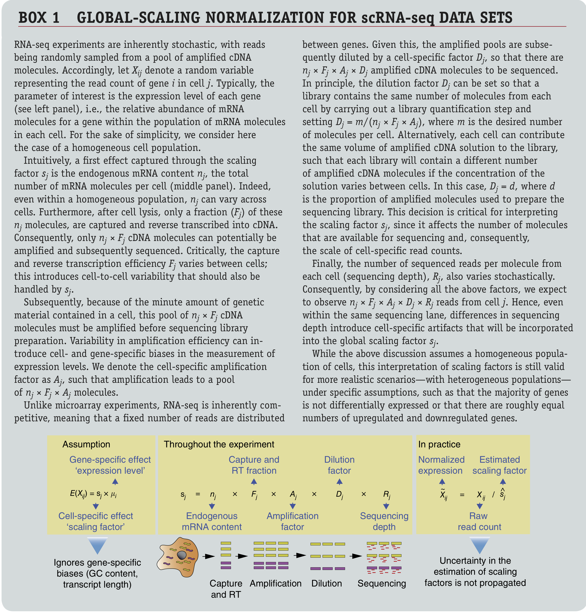

```{r functions, include=FALSE}
# A function for captioning and referencing images
fig <- local({
    i <- 0
    ref <- list()
    list(
        cap=function(refName, text) {
            i <<- i + 1
            ref[[refName]] <<- i
            paste("Figure ", i, ": ", text, sep="")
        },
        ref=function(refName) {
            ref[[refName]]
        })
})
``` 

```{r, echo=FALSE, message=FALSE, eval=TRUE}
suppressPackageStartupMessages({
  library(knitr)
  library(rmarkdown)
  library(ggplot2)
})
if(!"BiocManager" %in% installed.packages()[,1]){
  install.packages("BiocManager")
}
if(!"limma" %in% installed.packages()[,1]){
  BiocManager::install("limma")
}
if(!"edgeR" %in% installed.packages()[,1]){
  BiocManager::install("edgeR")
}
if(!"DESeq2" %in% installed.packages()[,1]){
  BiocManager::install("DESeq2")
}
if(!"scales" %in% installed.packages()[,1]){
  install.packages("scales")
}
```

In this lecture we will start working with a real bulk RNA-seq dataset from [Haglund *et al.* (2012)](https://academic.oup.com/jcem/article/97/12/4631/2536573). After importing the data, we will be working our way through four major challenges which, together, will form a full RNA-seq differential expression (DE) analysis pipeline where the result of our analysis will be a(n ordered) list of genes that we find to be differently expressed between our conditions of interest. The four main challenges we will look into are 

 - Choice of modeling assumptions (distribution).
 - Normalization.
 - Parameter estimation under a limited information setting.
 - Statistical inference under high dimensionality (many genes).

# Experimental design, data import and data exploration

## Experimental design

Let's try to work out the experimental design using the following paragraph from the Methods section of the paper.

```{r, echo=FALSE, fig.cap=paste("Figure: A paragraph from the Methods section.")}
# All defaults
include_graphics("./images_sequencing/expDesign_para.png")
```

## Data import and exploration

We will be importing the dataset using the [parathyroidSE](https://www.bioconductor.org/packages/release/data/experiment/html/parathyroidSE.html) data package from [Bioconductor](https://bioconductor.org/).

```{r, warning=FALSE, eval=TRUE}
if (!requireNamespace("BiocManager", quietly = TRUE)){
  install.packages("BiocManager")
}
if(!"SummarizedExperiment" %in% installed.packages()[,1]){
  BiocManager::install("SummarizedExperiment")
} 
# install package if not installed.
if(!"parathyroidSE" %in% installed.packages()[,1]) BiocManager::install("parathyroidSE")

suppressPackageStartupMessages({
  library(parathyroidSE)
  library(SummarizedExperiment)
})

# import data
data("parathyroidGenesSE", package="parathyroidSE")
# rename for convenience
se1 <- parathyroidGenesSE
rm(parathyroidGenesSE)

# three treatments
treatment1 <- colData(se1)$treatment
table(treatment1)
# two timepoints
time1 <- colData(se1)$time
table(time1)
# four donor patients
patient1 <- colData(se1)$patient
table(patient1)

table(patient1, treatment1, time1)
```

- We observe that the number of samples that we are observing here is larger than what is described in the paper. As also described in the [parathyroidSE vignette](https://www.bioconductor.org/packages/release/data/experiment/vignettes/parathyroidSE/inst/doc/parathyroidSE.pdf), some samples were spread over multiple sequencing runs (i.e., the same sample being sequenced repeatedly) and therefore constitute **technical replication**, rather than biological replication.
- We have previously seen that technical replicates can be considered to be distributed according to a Poisson distribution. One important property of Poisson random variables is that a sum of Poisson random variables still follow a Poisson distribution. Indeed, if $X \sim Poi(\mu_X)$ and $Y \sim Poi(\mu_Y)$, then $X + Y = Z \sim Poi(\mu_X + \mu_Y)$.
- For this reason, it is often suggested to sum technical replicates rather than, for example, averaging, which does not retain the Poisson property (try for yourself!). We'll therefore first sum the technical replicates.

```{r}
dupExps <- as.character(colData(se1)$experiment[duplicated(colData(se1)$experiment)])
dupExps

counts <- assays(se1)$counts
newCounts <- counts
cd <- colData(se1)
for(ss in 1:length(dupExps)){
  # check which samples are duplicates
  relevantId <- which(colData(se1)$experiment == dupExps[ss])
  # sum counts
  newCounts[,relevantId[1]] <- rowSums(counts[,relevantId])
  # keep which columns / rows to remove.
  if(ss == 1){
    toRemove <- relevantId[2]
  } else {
    toRemove <- c(toRemove, relevantId[2])
  }
}

# remove after summing counts (otherwise IDs get mixed up)
newCounts <- newCounts[,-toRemove]
newCD <- cd[-toRemove,]

# Create new SummarizedExperiment
se <- SummarizedExperiment(assays = list("counts" = newCounts),
                            colData = newCD,
                            metadata = metadata(se1))

treatment <- colData(se)$treatment
table(treatment)
time <- colData(se)$time
table(time)
patient <- colData(se)$patient
table(patient)

table(patient, treatment, time) # agrees with paper.

```

 - After summing the technical replicates and appropriately updating the sample information, we again create a `SummarizedExperiment` object, which is essentially a data container that contains all relevant information about your experiment. Please see the [vignette](https://bioconductor.org/packages/release/bioc/vignettes/SummarizedExperiment/inst/doc/SummarizedExperiment.html) for more information on how to use this class.
 - By directly matching columns (samples) and rows (genes) to their relevant metadata, the `SummarizedExperiment` class avoids mistakes by mis-matching columns and rows with each other (provided you haven't mismatched them when you creat the object).
 - The `SummarizedExperiment` class is modular and extendable, and extensions exist for example for the analysis of single-cell RNA-seq data.
 - Due to their convenient organization and widely supported usage within Bioconductor, we will typically work with such containers in the analysis of RNA-seq data.
 
## Independent filtering

Independent filtering is a strategy to remove features (in this case, genes) prior to the analysis. Removal of these features may lower the multiple testing correction for other genes that pass the filter. We try to remove genes that have a low power to be found statistically significant, and/or that are biologically less relevant. 
A common filtering strategy is to remove genes with a generally low expression, as low counts have lower relative uncertainty (hence lower statistical power), and may be considered biologically less relevant.

```{r}
suppressPackageStartupMessages({
  library(limma)
  library(edgeR)
})

keep <- rowSums(cpm(se) > 2) >= 3
table(keep)
se <- se[keep,]
```

## Data exploration

```{r}
# library size distribution
hist(colSums(assays(se)$counts)/1e6, breaks=10)
boxplot(colSums(assays(se)$counts)/1e6 ~ treatment)
boxplot(colSums(assays(se)$counts)/1e6 ~ time)
boxplot(colSums(assays(se)$counts)/1e6 ~ patient)
boxplot(colSums(assays(se)$counts)/1e6 ~ interaction(treatment, time))

# MDS plot
plotMDS(se, 
        labels = treatment, 
        col=as.numeric(patient))

## hard to see influence of experimental factors due to large between-patient variation
## we could also make an MDS plot per patient to take a look.
for(kk in 1:4){
  id <- which(patient == kk)
  plotMDS(se[,id], 
        labels = paste0(treatment[id],"_",time[id]), 
        col=as.numeric(time[id]))
}
```

```{r, eval=FALSE, echo=FALSE}
# Explain concept of MDS: preserve Euclidean distance from high to low dim.
```

Observations based on MDS plot:

 - There is a very large between-patient variability, which is the major source of variation in this dataset. The samples from each patient cluster together tightly.
 - Within patient, time consistently explains more variation than the treatments.
 - Relative to patients and time, the treatment seems to have a fairly small effect.

# Challenge I: Choice of modeling assumptions

When working with a GLM, as part of the choices of modeling assumptions, we need to pick an appropriate distribution for the expression counts. Below we perform some exploratory analyses to investigate.

```{r, eval=TRUE}
y <- assays(se)$counts[1,]
hist(y, breaks = 40,
     xlab = "Gene expression",
     xaxt = "n", yaxt = "n",
     main = "Data for the first gene")
axis(1, at = seq(200, 1200, by=200))
axis(2, at = 0:3)

# Mean-variance trend within each experimental condition
cont24ID <- which(treatment == "Control" & time == "24h")
DPN24ID <- which(treatment == "DPN" & time == "24h")
OHT24ID <- which(treatment == "OHT" & time == "24h")
cont48ID <- which(treatment == "Control" & time == "48h")
DPN48ID <- which(treatment == "DPN" & time == "48h")
OHT48ID <- which(treatment == "OHT" & time == "48h")
idList <- list(cont24ID, DPN24ID, OHT24ID, 
               cont48ID, DPN48ID, OHT48ID)
names(idList) <- paste0(rep(levels(treatment),2), rep(levels(time), each=3))

par(mfrow=c(3,2), mar=c(2,2,2,1))
for(kk in 1:length(idList)){
  # extract counts for each condition
  curCounts <- assays(se)$counts[,idList[[kk]]]
  curFracs <- sweep(curCounts, 2, FUN="/", STATS=colSums(curCounts))
  plot(x = rowMeans(curCounts)+1,
       y = rowVars(curCounts)+1,
       pch = 16, cex=1/2,
       xlab = "Mean", ylab="Variance",
       main = names(idList)[kk],
       log="xy")
  abline(0,1, col="red")
  lw1 <- loess((rowVars(curCounts)+1) ~ (rowMeans(curCounts)+1), span=1/4, lwd=3)
  oo <- order(rowMeans(curCounts)+1)
  lines(rowMeans(curCounts)[oo]+1, lw1$fitted[oo], col="orange")

  smoothScatter(x = log1p(rowMeans(curCounts)),
       y = log1p(rowVars(curCounts)),
       pch = 16, cex=1/2,
       xlab = "Mean", ylab="Variance")
  abline(0,1, col="red")
  lines(log(rowMeans(curCounts)[oo]+1), log(lw1$fitted[oo]+1), col="orange")
}
```

 - Having data on thousands of genes provides the opportunity to empirically assess the mean-variance relationship.
 - It is clear that the data is overdispersed with respect to the Poisson distribution (red $y=x$ line). There also seems to be a quadratic trend of the variance as a function of the mean. This has motivated the **negative binomial distribution as the most popular choice to model (bulk) RNA-seq gene expression data**.
 
 ---
 
 - The negative binomial distribution is also referred to as the Gamma-Poisson distribution as it can be formulated as such. Indeed, if 
 $$
 \lambda \sim \Gamma(\alpha, \beta) \\
 Y | \lambda \sim Poi(\lambda),
 $$
 then this is equivalent to
 $$ Y \sim NB(\mu = \alpha / \beta, \phi = 1/\alpha). $$
 - This can be shown analytically, but is considered out of the scope of this course. Below, we show it empirically using simulation.
 - This theoretical result has got some practical consequences. The Gamma-Poisson formulation makes it clear why we can sum technical replicates as the sum of Poisson random variables is again a Poisson random variable. 
 - The Poisson statement can thus be considered as capturing technical variation, while the Gamma statement can be considered to capture biological variation, i.e., variation in the mean expression across biological replicates.

```{r}
alpha <- 20
beta <- 10
lambda <- rgamma(n = 1e5, shape = alpha, rate = beta)
y1 <- rpois(n = 1e5, lambda = lambda)

# note phi = 1 / size
y2 <- rnbinom(n=1e5, mu=alpha / (beta), size=alpha)


plot(density(y1))
lines(density(y2), col="steelblue")
```


# Challenge II: Normalization

Normalization is necessary to correct for several sources of technical variation:

 - **Differences in sequencing depth** between samples. Some samples get sequenced deeper in the sense that they consist of more (mapped) reads and therefore can be considered to contain a higher amount of information, which we should be taking into account. In addition, if a sample is sequenced deeper, it is natural that the counts for each gene will be higher, jeopardizing a direct comparison of the expression counts.
 - **Differences in RNA population composition** between samples. As an extreme example, suppose that two samples have been sequenced to the exact same depth. One sample is contaminated and has a very high concentration of the contaminant cDNA being sequenced, but otherwise the two samples are identical. Since the contaminant will be taking up a significant proportion of the reads being sequenced, the counts will not be directly comparable between the samples. Hence, we may also want to correct for differences in the composition of the RNA population of the samples.
 - **Other technical variation** such as sample-specific GC-content or transcript length effects may also be accounted for.
 
 ---
 
Let's take a look at how comparable different replicates are in the Control condition at 48h in our dataset. We will investigate this using MD-plots (mean-difference plots as introduced by [Dudoit *et al.* (2002)](https://www.jstor.org/stable/24307038)), also sometimes referred to as MA-plots.

```{r}
cont48ID # relevant samples
colSums(assays(se)$counts[,cont48ID]) / 1e6
combs <- combn(cont48ID, m=2) #pairwise combinations between samples

par(mfrow=c(3,2), mar=c(4,4,2,1))
for(cc in 1:ncol(combs)){
  curSamples <- combs[,cc]
  M <- rowMeans(assays(se)$counts[,curSamples])
  D <- assays(se)$counts[,curSamples[2]] / assays(se)$counts[,curSamples[1]]
  plot(x = log(M), y = log2(D),
       pch = 16, cex=1/3,
       main = paste0("Sample ", curSamples[2], " vs sample ", curSamples[1]),
       xlab = "Log mean", ylab = "Log2 fold-change",
       bty = 'l')
  abline(h = 0, col="orange", lwd=2)
}
```
 
 - We see clear bias for some pairwise comparisons. For example, in the first plot comparing sample 8 versus sample 2, the log fold-changes are biased downwards. This means that, on average, a gene is lower expressed in sample 8 versus sample 2. Looking at the library sizes, we can indeed see that the library size for sample 2 is about $11 \times 10^6$ while it is only about $7 \times 10^6$ for sample 8! This is a clear library size effect that we should take into account.
 
## Count scaling versus GLM offsets

 - We have previously discussed count scaling transformations such as CPM and TPM.
 - A more appropriate and natural way when working with GLMs is through the use of **offsets**. The general use of an offset is to account for the 'effort' performed in order to gather that observation of the response variable. Two examples:
   1. A biologist studying whale migration has one fixed spot where, in the migration season, she counts migrating whales day after day, over several years. For each day she records the number of spotted whales. Of course, the time spent whale-watching may differ from day to day and it is natural that you are more likely to spot more whales if you spend more time looking for them. The time spent spotting whales can then be used as an offset.
   2. In our case, a sample being sequenced deeper contains more information, i.e., more 'effort' has been performed, as compared to a sample being sequenced relatively shallow. We have more confidence of a count from a deeply sequenced sample than from a shallowly sequenced sample. We can therefore use the sequencing depth $N_i = \sum_g Y_{gi}$ as offset in the model.
  - Adding an offset to the model is different from adding a new variable to the model. For each new variable we add, we will estimate its average effect $\beta$ on the response variable. When adding an offset, however, we are implicitly assuming that $\beta=1$.
  - Offsets are typically added on the scale of the linear predictor. Suppose we have a gene $g$ and sample $i$ specific offset $O_{gi}$, then we can define a negative binomial GLM including the offset as
  $$
  \left\{
  \begin{array}{ccc}
  Y_{gi} & \sim & NB(\mu_{gi}, \phi_g) \\
  \log \mu_{gi} & = & \eta_{gi} \\
  \eta_{gi} & = & \mathbf{X}^T_i \beta_g + \log(O_{gi}). \\
  \end{array}
  \right.
  $$
 - Please [read this page](https://statomics.github.io/SGA21/sequencing_scalingNormalization.html) for an intuitive reasoning as to why offsets are preferred over count scaling.
  
## How to normalize?

Many approaches are available for normalizing RNA-seq data, and we will review a couple of these. Most methods basically calculate an offset that is added to the GLM used to model gene expression. One notable method, full-quantile normalization, does not calculate an offset.
 
### TMM method (default of `edgeR`)

The trimmed mean of M-values (TMM) method introduced by [Robinson & Oshlack (2010)](https://genomebiology.biomedcentral.com/articles/10.1186/gb-2010-11-3-r25) is a normalization procedure that calculates a single normalization factor for each sample. As the name suggests, it is based on a trimmed mean of fold-changes ($M$-values) as the scaling factor. A trimmed mean is an average after removing a set of ``extreme'' values. 
Specifically, TMM calculates a normalization factor $F_i^{(r)}$ across genes $g$ for each sample $i$ as compared to a reference sample $r$,
$$
\log_2(F_i^{(r)}) = \frac{\sum_{g \in {\cal G}^*} w_{gi}^r M_{gi}^r}{\sum_{g \in {\cal G}^*} w_{gi}^r},
$$
where $M_{gi}^r$ represents the $\log_2$-fold-change of the gene expression fraction as compared to a reference sample $r$, i.e.,
\[ M_{gi}^r = \log_2\left( \frac{Y_{gi} / N_i}{ Y_{gr} / N_r} \right), \]
and $w_{gi}^r$ represents a precision weight calculated as
$$
 w_{gi}^r = \frac{N_i - Y_{gi}}{N_i Y_{gi}} + \frac{N_r - Y_{gr}}{N_r Y_{gr}},
$$
and ${\cal G}^*$ represents the set of genes after trimming those with the most extreme average expression. The weights serve to account for the fact that fold-changes for genes with lower read counts are more variable.

The procedure only takes genes into account where both $Y_{gi}>0$ and $Y_{gr}>0$. By default, TMM trims genes with the $30\%$ most extreme $M$-values and $5\%$ most extreme average gene expression, and chooses as reference $r$ the sample whose upper-quartile is closest to the across-sample average upper-quartile. The normalized counts are then given by $\tilde{Y}_{gi} = Y_{gi} / N_i^s$, where 
$$N_i^s = \frac{N_i F_i^{(r)}}{\sum_{i=1}^n N_i F_i^{(r)}/n}.$$

TMM normalization may be performed from the `calcNormFactors` function implemented in `edgeR`:

```{r}
dge <- edgeR::calcNormFactors(se)
dge$samples #normalization factors added to colData
```

Let's check how our MD-plots look like after normalization. Note that, we can rewrite the GLM as
$$ \log\left( \frac{\mu_{gi}}{N_i^s} \right) = \mathbf{X}_i^T \beta_g $$
and so $\frac{\mu_{gi}}{N_i^s}$ can be considered as an 'offset-corrected count'.

We see that all MD-plots are now nicely centered around a log-fold-change of zero!

```{r}
## normalize
effLibSize <- dge$samples$lib.size * dge$samples$norm.factors
normCountTMM <- sweep(assays(se)$counts, 2, FUN="/", effLibSize)


par(mfrow=c(3,2), mar=c(4,4,2,1))
for(cc in 1:ncol(combs)){
  curSamples <- combs[,cc]
  M <- rowMeans(normCountTMM[,curSamples])
  D <- normCountTMM[,curSamples[2]] / normCountTMM[,curSamples[1]]
  plot(x = log(M), y = log2(D),
       pch = 16, cex=1/3,
       main = paste0("Sample ", curSamples[2], " vs sample ", curSamples[1]),
       xlab = "Log mean", ylab = "Log2 fold-change",
       bty = 'l')
  abline(h = 0, col="orange", lwd=2)
}
```


## Median-of-ratios method (default of `DESeq2`)

The median-of-ratios method is used in `DESeq2` as described in [Love *et al.* (2014)](https://genomebiology.biomedcentral.com/articles/10.1186/s13059-014-0550-8).
It assumes that the expected value $\mu_{gi} = E(Y_{gi})$ is proportional to the true expression of the gene, $q_{gi}$, scaled by a normalization factor $s_{i}$ for each sample,
\[ \mu_{gi} = s_{i}q_{gi}. \]

The normalization factor $s_{i}$ is then estimated using the median-of-ratios method compared to a synthetic reference sample $r$ defined based on geometric means of counts across samples
$$
s_i = \text{median}_{\{{g:Y^{*}_{gr} \ne 0}\}} \frac{Y_{gi}}{Y^{*}_{gr}},
$$
with 
\[ Y^{*}_{gr} = \left( \prod_{i=1}^n Y_{gi} \right)^{1/n}. \]

We can then use the size factors $s_i$ as offsets to the GLM.

Median-of-ratios normalization is implemented in the `DESeq2` package:

```{r}
dds <- DESeq2::DESeqDataSetFromMatrix(countData = assays(se)$counts,
                                      colData = colData(se),
                                      design = ~ 1) #just add intercept to showcase normalization
dds <- DESeq2::estimateSizeFactors(dds)
sizeFactors(dds)
```

You may also want to check out the [StatQuest video on DESeq2 normalization](https://www.youtube.com/watch?v=UFB993xufUU).

## Full-quantile (FQ) normalization

In full-quantile normalization, originally introduced in the context of microarrays by [Bolstad *et al.* (2003)](https://academic.oup.com/bioinformatics/article/19/2/185/372664), the samples are forced to each have a distribution identical to the distribution of the median/average of the quantiles across samples.
In practice, we implement full-quantile normalization using the following procedure

 1. Given a data matrix $\mathbf{Y}_{G \times n}$ for $G$ genes (rows) and $n$ samples (columns),
 2. sort each column to get $\mathbf{Y}^S$,
 3. replace all elements of each row by the median (or average) for that row,
 4. obtain the normalized counts $\tilde{\mathbf{Y}}$ by re-arranging (i.e., unsorting) each column.

## Uncertainty in normalization

 - The offsets that are being cacluated for normalization purposes are estimates.
 - The downstream analyses incorporates these estimates as if they are known.
 - The analysis therefore **ignores the uncertainty** in their estimation.
 
 
```{r, echo=FALSE, fig.cap=paste("Figure: Box 1 from Vallejos et al. (2017).")}
# All defaults

```


# Challenge III: Parameter estimation (under limited information setting)

There are two challenges to be overcome here:

 - First, we need to get the structure of our mean model right, this is, which covariates to include, and how to include them, such that we are capable of capturing important sources of variation in our experiment, in order to derive a correct interpretation of the data in terms of our research question.
 - Second, we need to be able to estimate the parameters of our model in an efficient way, while having limited information (i.e., we often only have a small number of replicates).

## Defining the model for the mean

Let's first check how the authors of the original study parameterized the mean model.

```{r, echo=FALSE, fig.cap=paste("Figure: Another paragraph from the Methods section.")}
# All defaults
include_graphics("./images_sequencing/deAnalysis_para.png")
```

The authors write that they are "employing treatment type, time point and sample ID as factors in the model". Concerning experimental variables, this suggests they have added covariates defining the treatment and time point for each sample. The sample ID in the text refers to the original tissue sample and therefore corresponds to the donor patient. While there is also a variable called `sample` in the `colData`, this is not what the authors refer to. Note the ambiguity here and since the authors didn't share their code, this is hard to check! But, more on reproducibility later.

**Question**. What are the authors assuming when using this structure for the mean model? Do you think that there are extensions or simplifications of the mean model that would be relevant?

<details><summary> Answer. </summary><p>
The authors are acknowledging the relatedness of samples derived from the same donor patient by adding it as a fixed effect to the model, which is great. This blocking strategy has been extensively discussed in the proteomics part of this course.
However, by only adding a main effect for treatment and time, they are assuming that the effect of time is identical for all treatments, i.e., the average gene expression in-/decrease at 48h versus 24h is identical for the DPN, OHT or the control samples, which seems like a quite stringent assumption.
We can make the model more flexible (but also more complex) by allowing for a `treatment * time` interaction.
</p></details>

## Parameter estimation and empirical Bayes

 - Even in limited sample sizes, the parameters $\beta$ of the mean model may be estimated reasonably efficiently, and we have previously discussed the IRLS algorithm. 
 - However, estimating parameters for the variance (this is, the dispersion parameter $\phi$ from the negative binomial or the variance parameter $\sigma$ from the Gaussian) is typically quite a bit harder.
 - In genomics, we often take advantage of the parallel structure of the thousands of regression models (one for each gene) to **borrow information across genes** in a procedure called **empirical Bayes**, as also seen in the proteomics part of this course. 
 - In empirical Bayes, we basically take a semi-Bayesian approach to parameter estimation, where we use the data but also a prior distribution to derive our parameter estimate. However, what makes it empirical is that we are using the data to estimate this prior distribution, unlike in a fully Bayesian analysis where the prior distribution must be specified independently of the data. 
 - The basic assumption for this to make sense is that genes with similar means might have similar dispersion parameters (or variances), owing to the mean-variance trend. 

 ---
 
 - Once initial estimates for the gene-wise dispersions have been derived ($\hat{\Phi}_g^{ML}$ in the figure), we use a parametric model to estimate its distribution (typically as a function of the mean) across genes. This distribution is the **prior distribution**.
 - Then, each initial estimate is shrunken towards that empirically estimated prior distribution. The amount of shrinkage being performed is data-driven, and depends on the data, taking into account the precision of our initial estimate (i.e., shape of the likelihood) and the variability of the prior distribution.
 - These strategies result in impressive performance gains in terms of differential expression analysis and are implemented in all popular differential expression analysis software packages (though in slightly differing ways) like `limma`, `edgeR` and `DESeq2`.

```{r, echo=FALSE, fig.cap=paste("Figure 8 from Van den Berge *et al.* (2019).")}
# All defaults
include_graphics("./images_sequencing/empiricalBayes.png")
```

The blog post on [understanding empirical Bayes estimation using baseball statistics](http://varianceexplained.org/r/empirical_bayes_baseball/) is a great primer for further reading, as well as the [accompanying book](https://drob.gumroad.com/l/empirical-bayes) by David Robinson.

## In practice

Let's fit the model using `edgeR`.

```{r}
design <- model.matrix(~ treatment*time + patient, data=colData(se))

# independent filtering
keep <- filterByExpr(se, design = design)
se <- se[keep,]

dge <- calcNormFactors(se)
dge <- estimateDisp(dge, design) # estimate dispersion estimates
plotBCV(dge)
fit <- glmFit(dge, design)
head(fit$coefficients)
```

# Challenge IV: Statistical inference across many genes

## Contrasts on the treatment effects

We will first derive all contrasts that are also investigated in the original manuscript, using our extended model where we are allowing for an interaction effect between treatment and time.

The mean model is
$$ \log(\mu_{gi}) = \beta_{g0} + \beta_{g1} x_{DPN} + \beta_{g2} x_{OHT} + \beta_{g3} x_{48h} + \beta_{g4} x_{pat2} + \beta_{g5} x_{pat3} + \beta_{g6} x_{pat4} + \\ \beta_{g7} x_{DPN:48h} + \beta_{g8} x_{OHT:48h}. $$

The intercept corresponds to the log average gene expression in the control group at 24h for patient 1.

**DPN 24h vs control 24h.**
The respective means are
$$\log \mu_{g,DPN,24h} = \beta_{g0} + \beta_{g1},$$
$$\log \mu_{g,con,24h} = \beta_{g0}.$$
And their difference is
$$ \delta_g = \beta_{g1}. $$

**DPN 48h vs control 48h.**
The respective means are
$$\log \mu_{g,DPN,48h} = \beta_{g0} + \beta_{g1} + \beta_{g3} + \beta_{g7},$$
$$\log \mu_{g,con,48h} = \beta_{g0} + \beta_{g3}.$$
And their difference is
$$ \delta_g = \beta_{g1} + \beta_{g7}. $$

**OHT 24h vs control 24h.**
The respective means are
$$\log \mu_{g,OHT,24h} = \beta_{g0} + \beta_{g2} ,$$
$$\log \mu_{g,con,24h} = \beta_{g0}.$$
And their difference is
$$ \delta_g = \beta_{g2}. $$

**OHT 48h vs control 48h.**
The respective means are
$$\log \mu_{g,OHT,48h} = \beta_{g0} + \beta_{g2} + \beta_{g3} + \beta_{g8},$$
$$\log \mu_{g,con,48h} = \beta_{g0} + \beta_{g3}.$$
And their difference is
$$ \delta_g = \beta_{g2} + \beta_{g8}. $$

However, we can also assess the interaction effects: is the time effect different between DPN and OHT treatment versus the control? And how about the DPN vs OHT treatments?

**DPN vs control interaction.**
The time effect for each condition is
$$ \delta_{DPN} = \log \mu_{g,DPN,48h} - \log \mu_{g,DPN,24h} = \beta_{g3} + \beta_{g7},$$
$$ \delta_{con} = \log \mu_{g,con,48h} - \log \mu_{g,con,24h} = \beta_{g3}. $$
So the interaction effect is
$$\delta_{DPN-con} = \beta_{g7}.$$

**OHT vs control interaction.**
The time effect for each condition is
$$ \delta_{OHT} = \log \mu_{g,OHT,48h} - \log \mu_{g,OHT,24h} = \beta_{g3} + \beta_{g8},$$
$$ \delta_{con} = \log \mu_{g,con,48h} - \log \mu_{g,con,24h} = \beta_{g3}. $$
So the interaction effect is
$$\delta_{DPN-con} = \beta_{g8}.$$

**OHT vs DPN interaction.**
The time effect for each condition is
$$ \delta_{OHT} = \log \mu_{g,OHT,48h} - \log \mu_{g,OHT,24h} = \beta_{g3} + \beta_{g8},$$
$$ \delta_{DPN} = \log \mu_{g,DPN,48h} - \log \mu_{g,DPN,24h} = \beta_{g3} + \beta_{g7},$$
So the interaction effect is
$$\delta_{OHT-DPN} = \beta_{g8} - \beta_{g7}.$$

Let's implement all of these in a contrast matrix.

```{r}
L <- matrix(0, nrow = ncol(fit$coefficients), ncol = 7)
rownames(L) <- colnames(fit$coefficients)
colnames(L) <- c("DPNvsCON24", "DPNvsCON48",
                 "OHTvsCON24", "OHTvsCON48",
                 "DPNvsCONInt", "OHTvsCONInt",
                 "OHTvsDPNInt")
# DPN vs control at 24h
L[2,"DPNvsCON24"] <- 1
# DPN vs control at 48h
L[c(2,8),"DPNvsCON48"] <- 1
# OHT vs control at 24h
L[3,"OHTvsCON24"] <- 1
# OHT vs control at 48h
L[c(3,9),"OHTvsCON48"] <- 1
# DPN control interaction
L[8,"DPNvsCONInt"] <- 1
# OHT control interaction
L[9,"OHTvsCONInt"] <- 1
# OHT DPN interaction
L[c(9,8),"OHTvsDPNInt"] <- c(1, -1)

L
```

And, finally, we can assess each hypothesis using the `glmLRT` function implemented in `edgeR`. We can assess each hypothesis separately by looping over the contrasts.

```{r}
lrtList <- list() #list of results
for(cc in 1:ncol(L)) lrtList[[cc]] <- glmLRT(fit, contrast = L[,cc])

# p-value histograms
pvalList <- lapply(lrtList, function(x) x$table$PValue)
pvalMat <- do.call(cbind,  pvalList)
colnames(pvalMat) <- colnames(L)
par(mfrow=c(3,3))
sapply(1:ncol(pvalMat), function(ii) hist(pvalMat[,ii], 
                                          main = colnames(pvalMat)[ii],
                                          xlab = "p-value"))
```

### Multiple testing

```{r}
# number of DE genes
padjMat <- apply(pvalMat, 2, p.adjust, method="fdr")
colSums(padjMat <= 0.05 )
```

We are finding low numbers of DE genes between treatments at a 5\% FDR level. This was already reflected in the the MDS plots.

### Visualization

Let's visualize some results for the DPN vs control at 48h contrast.

```{r}
library(scales) # for scales::alpha()
deGenes <- p.adjust(lrtList[[2]]$table$PValue, "fdr") <= 0.05

## volcano plot
plot(x = lrtList[[2]]$table$logFC,
     y = -log10(lrtList[[2]]$table$PValue),
     xlab = "log Fold-change",
     ylab = "-log10 P-value",
     pch = 16, col = alpha(deGenes+1, .4), 
     cex=2/3, bty='l')
legend("topright", c("DE", "not DE"),
       col = 2:1, pch=16, bty='n')

## MD-plot
plot(x = lrtList[[2]]$table$logCPM,
     y = lrtList[[2]]$table$logFC,
     xlab = "Average log CPM",
     ylab = "Log fold-change",
     pch = 16, col = alpha(deGenes+1, .4), 
     cex=2/3, bty='l')
legend("topright", c("DE", "not DE"),
       col = 2:1, pch=16, bty='n')
abline(h=0, col="orange", lwd=2, lty=2)

```

 ---

```{r}
# extract all DE genes
deGenes <- rownames(lrtList[[2]]$table)[p.adjust(lrtList[[2]]$table$PValue, "fdr") <= 0.05]
deGenes
# order according to absolute fold-change
orderedDEGenes <- deGenes[order(abs(lrtList[[2]]$table[deGenes, "logFC"]), decreasing = TRUE)]

par(mfrow=c(3,3))
for(kk in 1:9){
  boxplot(log1p(assays(se)$counts[orderedDEGenes[kk],]) ~ interaction(treatment, time))
  boxplot(fit$fitted.values[orderedDEGenes[kk],] ~ interaction(treatment, time))
}
```


## Contrast on the time effect

Based on the MDS plot, we can expect comparatively more DE genes for the time effect. For didactic purposes, here we assess an **average time effect across the three treatments**. The analysis shows how flexible one can be when using contrasts.

Mean of time 24h:
$$\log \mu_{g,24h} = \frac{1}{3} \left\{ \underbrace{(\beta_{g0})}_\text{Control, 24h} + \underbrace{(\beta_{g0} + \beta_{g1})}_\text{DPN, 24h} + \underbrace{(\beta_{g0} + \beta_{g2})}_\text{OHT, 24h} \right\}$$

Mean of time 48h:
$$\log \mu_{g,48h} = \frac{1}{3} \left\{ \underbrace{(\beta_{g0} + \beta_{g3})}_\text{Control, 48h} + \underbrace{(\beta_{g0} + \beta_{g1} + \beta_{g3} + \beta_{g7})}_\text{DPN, 48h} + \underbrace{(\beta_{g0} + \beta_{g2}+ \beta_{g3} + \beta_{g8})}_\text{OHT, 48h} \right\}$$

Difference:
$$ \log \left( \frac{\mu_{g,48h}}{\mu_{g,24h}} \right) = \beta_{g3} + \frac{1}{3}(\beta_{g7} + \beta_{g8}) $$


```{r}
Ltime <- matrix(0, nrow = ncol(fit$coefficients), ncol = 1)
rownames(Ltime) <- colnames(fit$coefficients)
Ltime[c("time48h", "treatmentDPN:time48h", "treatmentOHT:time48h"),1] <- c(1, 1/3, 1/3)

lrtTime <- glmLRT(fit, contrast=Ltime)
hist(lrtTime$table$PValue) # very different p-value distribution

sum(p.adjust(lrtTime$table$PValue, "fdr") <= 0.05) # many DE genes
```


# Alternative parameterizations

While our design matrix here was parameterized as `~ treatment*time + patient` alternative, equivalent parameterizations are also possible.
Below, we demonstrate another parameterization that could work, too, and can be more intuitive. In this parameterization, we estimate a mean for each experimental condition, without an intercept, which can be convenient to think about how to set up contrasts.

```{r}
treatTime <- as.factor(paste0(treatment, time))
table(treatTime)

design2 <- model.matrix(~ 0 + treatTime + patient)

dge2 <- calcNormFactors(se)
dge2 <- estimateDisp(dge2, design2)
plotBCV(dge2)
fit2 <- glmFit(dge2, design2)
head(fit2$coefficients)

## for example: the estimate for the DPN24h vs control 24h is still the same,
## but requires a different combination of parameters
plot(fit$coefficients[,"treatmentDPN"], 
     fit2$coefficients[,"treatTimeDPN24h"] - fit2$coefficients[,"treatTimeControl24h"],
     xlab="Intercept model estimate", ylab="No intercept model estimate")

# Let's implement the DPNvsCON48 contrast
L2 <- matrix(0, nrow = ncol(fit2$coefficients), ncol = 1)
rownames(L2) <- colnames(fit2$coefficients)
L2[c("treatTimeDPN48h", "treatTimeControl48h"),1] <- c(1, -1)
lrt2 <- glmLRT(fit2, contrast=L2[,1])
hist(lrt2$table$PValue)


plot(x=lrt2$table$PValue, y=lrtList[[2]]$table$PValue,
     xlab="No intercept model p-value",
     ylab="Intercept model p-value")
```


# Additional Challenge (Opportunity?): The importance of reproducible analysis

Finally, it is crucial to make your analysis reproducible using tools such as RMarkdown and GitHub. Please sit back and watch this [amazing lecture from Professor Keith Baggerly on "The Importance of Reproducible Research in High-Throughput Biology](https://www.youtube.com/watch?v=8QJfNS7XXwA).

