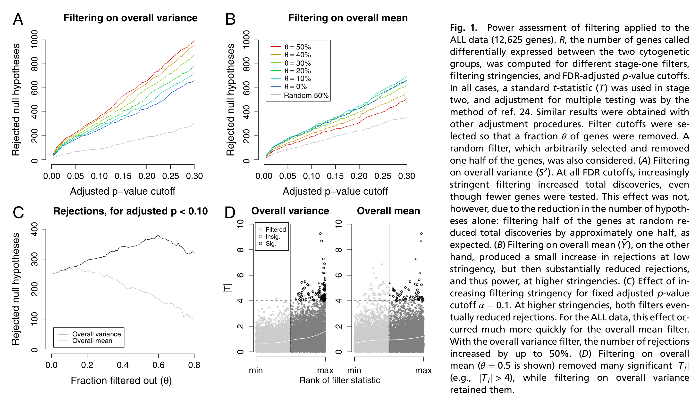
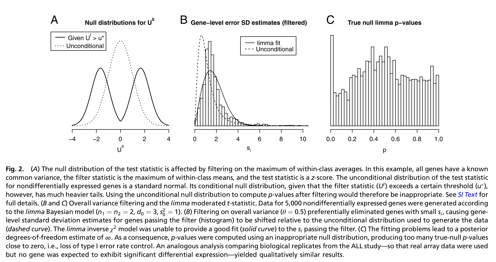
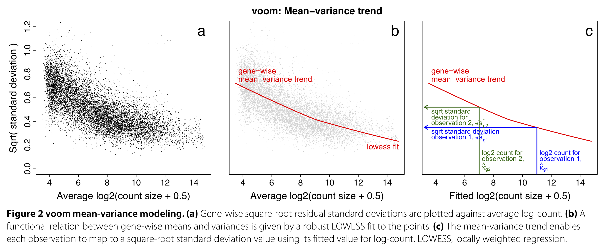

```{r functions, include=FALSE}
# A function for captioning and referencing images
fig <- local({
    i <- 0
    ref <- list()
    list(
        cap=function(refName, text) {
            i <<- i + 1
            ref[[refName]] <<- i
            paste("Figure ", i, ": ", text, sep="")
        },
        ref=function(refName) {
            ref[[refName]]
        })
})
``` 

```{r, echo=FALSE, message=FALSE, eval=TRUE}
suppressPackageStartupMessages({
  library(knitr)
  library(rmarkdown)
  library(ggplot2)
})
```

# Independent filtering

Independent filtering, where genes/transcripts/proteins are filtered out prior to statistical analysis, is a common practice in 'omics experiments. Typically, lowly expressed features are filtered out, and one can argue that these features' expression is too low to be deemed biologically relevant. In addition, low-count features are also associated with a low statistical power for differential expression (remember relative uncertainty of counts, and `edgeR`'s BCV plot), and will increase the number of tests performed, and therefore lead to a more severe multiple testing correction.

```{r, echo=FALSE, fig.cap=paste("Figure 1 from Bourgon *et al.* (2010).")}
# All defaults

```

 ---

Independent filtering has been formalized by [Bourgon *et al.* (2010)](https://www.pnas.org/content/107/21/9546), and the concept can be summarized as follows.

 - For each feature we calculate two statistics, $S_F$ and $S_T$, respectively used for two stages: filtering and testing (e.g., differential expression).
 - In order for a feature to be deemed significant, both of its statistics must be greater than some cut-off.
 - We want to control the type I error rate of the second stage (testing). But note that **the second stage is conditional on the first stage**, as we only test features passing the filter, and basically ignore the fact that filtering was performed. Indeed, one criticism is that computing and correcting the $p$-values as if filtering had not been performed may lead to overoptimistic adjusted $p$-values.
 - [Bourgon *et al.* (2010)](https://www.pnas.org/content/107/21/9546) show that filtering is only appropriate (i.e., does not inflate type I error rate) if the conditional null distribution of test statistics for features passing the filter is the same as the unconditional null distribution. Therefore, **filtering is appropriate if the statistic used for filtering is independent of the statistic used for testing under the null hypothesis**.
 
```{r, echo=FALSE, fig.cap=paste("Figure 2 from Bourgon *et al.* (2010).")}
# All defaults

```
  ---
  
Let's try a couple of examples to get some intuition using simulated data.

```{r}
suppressPackageStartupMessages(library(DESeq2))
set.seed(24)
dds <- DESeq2::makeExampleDESeqDataSet()
simCounts <- counts(dds)
group <- dds$condition
```

## A dependent test statistic

```{r}
## filter based on difference in means
filterStatEffectSize <- abs(rowMeans(simCounts[,group == "A"]) - rowMeans(simCounts[,group == "B"]))
## calculate t-test results for each gene
testStat <- genefilter::rowttests(simCounts, group)

## unconditional distribution of test statistics prior to filtering
plot(density(testStat$statistic, na.rm=TRUE),
     xlab = "Test statistic",
     main = "Unconditional distribution")

# filter out ~20% of genes with lowest effect sizes
mean(filterStatEffectSize > 1)
hist(filterStatEffectSize, breaks=40)
abline(v=1, col="red")
keepEffectSize <- filterStatEffectSize > 1
## conditional distribution: very different!
plot(density(testStat$statistic[keepEffectSize], na.rm=TRUE),
     xlab = "Test statistic",
     main = "Conditional distribution")


## in same plot
plot(density(testStat$statistic, na.rm=TRUE),
     xlab = "Test statistic",
     col = "orange",
     main = "Test statistics before and after filtering on mean difference",
     lwd = 2)
lines(density(testStat$statistic[keepEffectSize], na.rm=TRUE),
     xlab = "Test statistic",
     main = "Conditional distribution",
     col = "steelblue",
     lwd = 2)
legend("topright", c("Unconditional", "Conditional"),
       col=c("orange", "steelblue"), lwd=2, bty='n')
```


## An independent test statistic

```{r}
filterStatGlobalMean <- rowMeans(simCounts)
# we remove a similar fraction of ~20% genes
mean(filterStatGlobalMean > 5) 
keepGlobalMean <- filterStatGlobalMean > 5

## unconditional distribution
plot(density(testStat$statistic, na.rm=TRUE),
     xlab = "Test statistic",
     main = "Unconditional distribution")

## conditional distribution: the same.
plot(density(testStat$statistic[keepGlobalMean], na.rm=TRUE),
     xlab = "Test statistic",
     main = "Conditional distribution")


## in same plot
plot(density(testStat$statistic, na.rm=TRUE),
     xlab = "Test statistic",
     col = "orange",
     main = "Test statistics before and after filtering on global mean",
     lwd = 2)
lines(density(testStat$statistic[keepGlobalMean], na.rm=TRUE),
     xlab = "Test statistic",
     main = "Conditional distribution",
     col = "steelblue",
     lwd = 2)
legend("topright", c("Unconditional", "Conditional"),
       col=c("orange", "steelblue"), lwd=2, bty='n')
```


# Aliasing

Suppose we are working with the following experimental design on colon cancer. Studying the effect of a drug on gene expression, researchers gather RNA-seq data from four colon cancer patients and four healthy individuals. For each individual, they obtain RNA-seq data from a blood sample before as well as two weeks after taking a daily dose of the drug. The research question relates to differential expression after vs. before taking the drug, in particular whether this is different for the diseased versus healthy group (i.e., the interaction between time (before/after taking the drug) and disease status (healthy/colon cancer)).

In terms of the model matrix, we could imagine a design such as ` ~ patient + disease*time`, where 

 - `disease` is a binary indicator referring to colon cancer versus control sample.
 - `time` defines if the sample is taken before or after taking the drug.
 - `patient` defines the individual donor the sample comes from.

The research question could then amount to testing the `disease * time` interaction.

Let's try this, by simulating random data for one gene.

```{r}
set.seed(2)
patient <- factor(rep(letters[1:8], each=2)) # 2 samples per patient
disease <- factor(c(rep("healthy",8), rep("cancer",8)), levels=c("healthy", "cancer")) # first four are healthy, next four are alcoholic
time <- factor(rep(c("before", "after"), 8), levels=c("before", "after")) # one before and one after sample for each

table(patient, disease, time)

## simulate data for one gene
n <- 16
y <- rpois(n = n, lambda = 50)

## fit a Poisson model
m <- glm(y ~ patient + disease*time,
         family = "poisson")
summary(m)
```

 ---
 
We find that one of the coefficients is `NA`! This is obviously not because we're dealing with `NA` values in the data as we've just simulated the response variable ourselves. What's going on?

One of the parameters, in this case the parameter distinguishing cancer from healthy patients **cannot be estimated as it is a linear combination of other parameters**. In our case, estimating the diseased effect would use information that is already used to estimate the patient-level intercepts. In other words, **once you know the patient, you immediately also know the disease status**, so estimating the diseased vs healthy effect on top of the patient effect provides no additional information if we have already estimated the patient-level effects. This concept is called aliasing, and is a common technical issue in 'omics experiments with complex experimental designs. 

 ---

While to understand the origin of the aliasing it is crucial to understand the relationship between the variables in the experimental design, we can also investigate it in detail using the `alias` function, to give us an idea.

```{r}
alias(m)
```

We see that the effect `diseasecancer` is a linear combination of the patient-specific effects of the cancer patients. This makes sense!

 --- 

For clarity, let's reproduce this using our design matrix.

```{r}
X <- model.matrix(~ patient + disease*time) # this is the design used in glm()

## these are indeed identical.
X[,"diseasecancer"]
X[,"patiente"] + X[,"patientf"] + X[,"patientg"] + X[,"patienth"]
```

Since one of our parameters is a linear combination of other parameters, it cannot be estimated simultaneously with the other parameters. In this case, we can actually drop the `disease` main effect from the model, since we know that it is already included in the `patient` effect.

 ---

We will have to carefully construct our design matrix in order to account for all important sources of variation while still allowing us to answer the research question of interest. The aliasing exploration above has made it clear we may drop the `disease` main effect, so let's start by constructing this design matrix.

```{r}
X <- model.matrix(~ patient + time + disease:time)

m2 <- glm(y ~ -1 + X,
         family = "poisson")
summary(m2)
alias(m2)
```

We are still confronted with aliasing as the model matrix contains an interaction effect `timebefore:diseasecancer` as well as `timeafter:diseasecancer`, while only the latter is relevant. Indeed, we know that we can derive the `timebefore:diseasecancer` effect by averaging the patient effects of the cancer patients.

 ---

```{r}
X <- X[,!colnames(X) %in% "timebefore:diseasecancer"]


## fit a Poisson model
m2 <- glm(y ~ -1 + X,
         family = "poisson")
summary(m2)
```

We see that all coefficients can now be estimated. The `timeafter` effect may be interpreted as the time effect for healthy patients, while the `timeafter:diseasecancer` effect may be interpreted as the difference in the time effect for cancer patients as compared to healthy patients, i.e., it is the relevant interaction effect we are interested in. 

**Question**. Taking this further, suppose that we can safely assume that there is no interaction effect between disease status and time. How would you now test for differential expression between healthy and cancer patients at the first timepoint? Specify the experimental design and contrast used.

<details><summary> Answer. </summary><p>
Assuming no interaction, we can specify the design as follows:

```{r}
XMain <- model.matrix(~ patient + time)
head(XMain)
```

In order to set up the contrast testing for healthy versus diseased patients at the first timepoint, we need to take the average of the appropriate patient-level intercepts.
The average expression for healthy patients is
$$ \log \mu_{healthy} = \frac{1}{4} \left\{ \beta_0 + (\beta_0 + \beta_1) + (\beta_0 + \beta_2) + (\beta_0 + \beta_3) \right\}. $$
Similar, for the diseased patients it equals
$$ \log \mu_{diseased} = \frac{1}{4} \left\{ (\beta_0 + \beta_4) + (\beta_0 + \beta_5) + (\beta_0 + \beta_6) + (\beta_0 + \beta_7) \right\}. $$
And thus the relevant contrast
$$ \log \frac{\mu_{diseased}}{\mu_{healthy}} = \frac{1}{4} (\beta_4 + \beta_5 + \beta_6 + \beta_7 ) - \frac{1}{4} (\beta_1 + \beta_2 + \beta_3).$$
</p></details>

# limma-voom as an alternative approach to modeling counts

`limma` is a powerful linear model based framework for modeling microarray gene expression data and inferring differential expression results, and has been introduced in the proteomics module of this course. With the inception of RNA-seq, the `limma` developers got creative and extended their framework to also model count data, hence creating limma-voom.

## The limma framework for the analysis of microarrays

In the proteomics module, we have previously introduced the powerful linear model based framework `limma`, and how it uses an empirical Bayes strategy to borrow information across proteins to derive a posterior variance estimate. In its default implementation, `limma` cannot be used to model count data, as it can not account for their mean-variance relationship. The developers, however, came up with a creative approach to use the `limma` framework to model coutn data.

## limma-voom: extending limma for RNA-seq data

 - Count models such as `edgeR` and `DESeq2` automatically account for the mean-variance relationship of the data by assuming a proper count distribution, given that the observed mean-variance relationship is close to the one assumed by the distribution. However, they are also more complex, both computationally as well as statistically and conceptually.
 - limma-voom ([Law *et al.* (2014)](https://genomebiology.biomedcentral.com/articles/10.1186/gb-2014-15-2-r29)) is a method that unlocks Gaussian linear models to analyze count data in the context of RNA-seq, by first estimating the mean-variance relationship of the dataset at hand, and subsequently incorporating it in the analysis through observation-level weights in a linear regression model.
 
```{r, echo=FALSE, fig.cap=paste("Figure 1 from Law *et al.* (2014).")}
# All defaults
include_graphics("./images_sequencing/limmaVoomMeanVariance.png")
```
 
 ---
 
 - The mean-variance relationship is dataset-specific and needs to be estimated separately for each dataset.
 - The mean-variance trend is estimated nonparametrically across all genes, using a global mean and variance for each gene. Using this trend, observation-level variances are estimated for each individual observation.
 - These observation-level variances are then used as inverse weights in the linear modeling framework, to account for heteroscedasticity.

```{r, echo=FALSE, fig.cap=paste("Figure 1 from Law *et al.* (2014).")}
# All defaults

```

## limma-voom analysis of parathyroid data

`limma` has an extensive user's guide which can be accessed via `limma::limmaUsersGuide()`.

```{r}
library(limma)
library(edgeR)
se <- readRDS("data/seParathyroid.rds")
se
design <- model.matrix(~treatment*time+patient, 
                       data=colData(se))

keep <- filterByExpr(se, design)
table(keep)
filtCounts <- assays(se)$counts[keep,]

dge <- DGEList(counts=filtCounts)

# normalize just as in edgeR
dge <- calcNormFactors(dge)
# fit the mean-variance trend used to calculate weights
v <- voom(dge, design, plot=TRUE)
# this mean-variance trend is then automatically incorporated into the usual limma pipeline
fit <- lmFit(v, design)
fit <- eBayes(fit)
tt <- topTable(fit, coef=(ncol(design-1):ncol(design)), number=nrow(dge)) # test interaction effects
head(tt) #similar as in edgeR, we find no DE
```

### Testing contrasts using limma-voom

When working with limma-voom, we cannot immediately test a contrast using a contrast matrix just like we did in `edgeR`.
Instead, we will reparametrize our model according to the contrasts, such that each parameter corresponds to a specific contrast, using the `contrasts.fit` function.

```{r}
# contrast matrix we used before
L <- matrix(0, nrow = ncol(fit$coefficients), ncol = 7)
rownames(L) <- colnames(fit$coefficients)
colnames(L) <- c("DPNvsCON24", "DPNvsCON48",
                 "OHTvsCON24", "OHTvsCON48",
                 "DPNvsCONInt", "OHTvsCONInt",
                 "OHTvsDPNInt")
# DPN vs control at 24h
L[2,"DPNvsCON24"] <- 1
# DPN vs control at 48h
L[c(2,8),"DPNvsCON48"] <- 1
# OHT vs control at 24h
L[3,"OHTvsCON24"] <- 1
# OHT vs control at 48h
L[c(3,9),"OHTvsCON48"] <- 1
# DPN control interaction
L[8,"DPNvsCONInt"] <- 1
# OHT control interaction
L[9,"OHTvsCONInt"] <- 1
# OHT DPN interaction
L[c(9,8),"OHTvsDPNInt"] <- c(1, -1)
L

fit <- lmFit(v, design)
fit2 <- contrasts.fit(fit, L)
fit2 <- eBayes(fit2)
head(fit2$coefficients) # one coefficient is one contrast
# loop over all contrasts of interest
ttList <- list()
for(cc in 1:ncol(L)){
  ttList[[cc]] <- topTable(fit2, coef=cc, number=nrow(dge))
}
names(ttList) <- colnames(L)
nDE <- unlist(lapply(ttList, function(x) sum(x$adj.P.Val <= 0.05)))
nDE
```